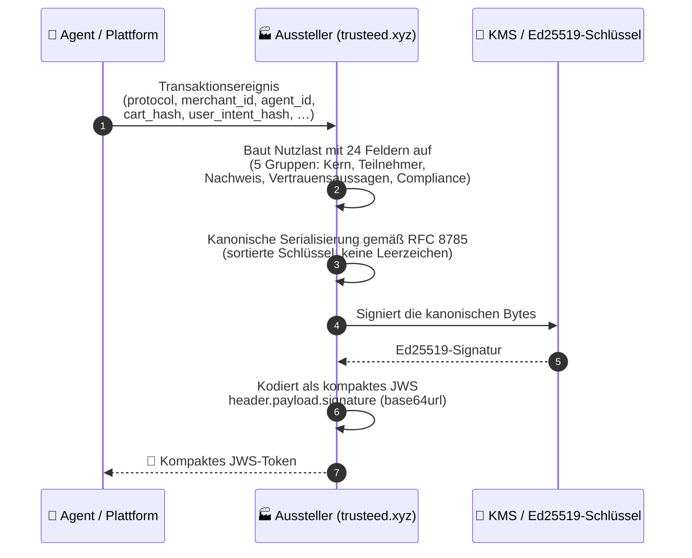
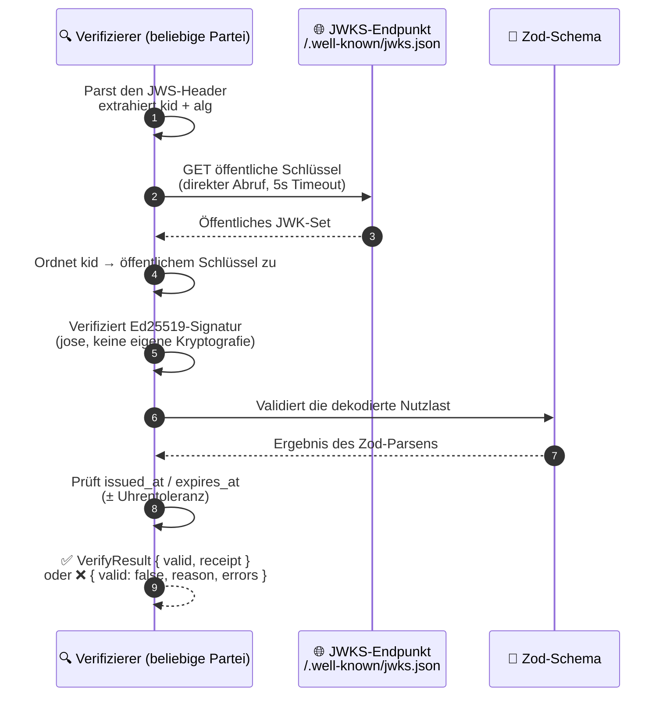
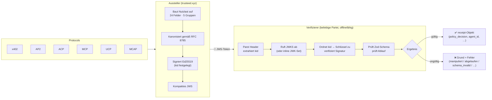

[English](README.md) | [Español](README.es.md) | [Français](README.fr.md) | **Deutsch**

# TrustReceipt

**Nachweisschicht auf Händlerseite für agentischen Handel: portable, signierte Belege, die sich offline verifizieren lassen**

[](SPEC.md)
[](LICENSE)
[](https://www.npmjs.com/package/trust-receipt-verifier)
[](https://github.com/Trusteedxyz/Trust-Receipt-Verifier)

---

## Was es ist

TrustReceipt ist ein offenes Belegformat für Händler. Es hält Nachweise über Transaktionen im agentischen Handel in einer Form fest, die jeder offline verifizieren kann, und zwar über Protokolle wie ACP, AP2, x402, MCP, UCP und MCAP hinweg. Es steht neben diesen Protokollen. AP2-Mandate, ACP-Checkout-Sitzungen, Visa-TAP-Signaturen und x402-Abwicklungen bleiben unverändert, und TrustReceipt ergänzt für jede davon einen portablen kryptografischen Nachweis der angewendeten Richtlinienentscheidung.

Ein TrustReceipt ist eine als JWS signierte JSON-Nutzlast, die Sie offline gegen einen öffentlichen JWKS-Endpunkt verifizieren können. Jeder Beleg hält fest, wer der Agent war, welches Protokoll lief, welche Vertrauensanbieter für die Transaktion gebürgt haben, welche Richtlinie galt und zu welcher Entscheidung sie kam. Das alles steckt in einem einzigen, in sich geschlossenen Token, das jede Partei prüfen kann, ohne den Aussteller anzufragen.

Dieses Paket ist die Referenzimplementierung von Verifizierer und Aussteller. Es gehört zum Merchant-Control-Stack von Trusteed (Richtlinien-Snapshots + Agenten-Kontrollpunkte + Belege), aber das Belegformat selbst ist offen und über Aussteller hinweg portabel.

---

## Aktuelle Updates (2026-09-16)

Diese Synchronisierung bringt das öffentliche Repo auf den Stand der Referenzimplementierung (vorherige Synchronisierung: 2026-08-17) und enthält eine Genauigkeitsprüfung der bestehenden Dokumentation. Neu:

- Zwei neue Drittanbieter-Identitätsverifizierer, die jeweils ohne den Transport des zugrunde liegenden Protokolls auskommen. Merchant Identity Assertions (MIA) deckt selbst ausgestellte und DNS-autorisierte Ausstellung durch Dritte ab (`draft-anders-merchant-identity-assertions-01`, 30 Vektoren). Die AGTP-Händleridentität deckt Prüfungen von Agent Identity Document, Intent Assertion und Cart-Digest ab (`draft-hood-agtp-merchant-identity-02`, 50 Vektoren).
- Mandats- und Genehmigungsnachweis, State-Witness-Nachweis und Operationsverknüpfung: drei neue optionale Feldgruppen (siehe Beleg-Anatomie und SPEC.md §3.2), identisch in alle drei Belegformen eingefügt, ohne `schema_version` zu erhöhen.
- Der ATEP-Pass-Referenzverifizierer (`reference-verifier/verify-atep-passport.mjs`), ein abhängigkeitsfreies Skript, das nur Node-Built-ins nutzt. Es zeigt, dass eine portable Vertrauensbestätigung eines Händlers offline und ohne jeglichen Trusteed-Code verifizierbar ist.
- Ein 7. `legacy-compact`-Konformitätsvektor (Signer-Erklärung).
- Zwei Genauigkeitskorrekturen an bestehender Dokumentation. Die Zeile „11 v1.1-Vektoren" unterzählte eine Tabelle, die bereits 12 Zeilen hatte (SPEC.md §11.6). Und `CONTRIBUTING.md`, `docs/architecture.md` und der Konformitätsabschnitt dieses README sagen jetzt, dass `scripts/validate-vectors.ts` derzeit 9/10 meldet, nicht 10/10 (TC-007 / `expired`, [Issue #6](https://github.com/Trusteedxyz/Trust-Receipt-Verifier/issues/6)). Code und Spec widersprechen sich bei diesem Vektor.
- Eine Verpackungslücke, die schon bestand und jetzt nachverfolgt wird: Die RFC-3161-Zeile galt als „optional", ist aber für keinen externen Installer heute nutzbar ([Issue #5](https://github.com/Trusteedxyz/Trust-Receipt-Verifier/issues/5)).
- CHANGELOG.md-Bereinigung: Zwei Einträge standen seit vor dem öffentlichen Launch unter einer veralteten „Unreleased"-Überschrift, obwohl sie bereits veröffentlicht waren. Sie sind mit der tatsächlichen Version und dem Datum umbenannt. Ein Absatz über die interne Trusteed-Deployment-Kopplung und ein unerreichbarer Verweis auf ein Schwesterpaket, beide aus dem Monorepo eingeschleppt, wurden entfernt.

Siehe [CHANGELOG.md](CHANGELOG.md) für die vollständige Versionshistorie.

---

## Fähigkeitsstatus

| Fähigkeit                                                                | Status                             | Anmerkungen                                                                                                                                                                                                                |
| ------------------------------------------------------------------------ | ---------------------------------- | -------------------------------------------------------------------------------------------------------------------------------------------------------------------------------------------------------------------------- |
| JWS-Verifikation (Ed25519)                                               | ✅ Implementiert                   | CLI + Bibliothek, keine eigene Kryptografie (verwendet `jose` v6)                                                                                                                                                          |
| JWKS-basierte Auflösung öffentlicher Schlüssel                           | ✅ Implementiert                   | Direktes `fetch()` pro Verifikation (5s Timeout), kein prozessinterner Cache; auch ein inline JWK-Set wird unterstützt                                                                                                     |
| Schema v1.0                                                              | ✅ Stabil                          | 10 Konformitätsvektoren bestehen                                                                                                                                                                                           |
| Schema v1.1 (eIDAS-ausgerichtete Felder)                                 | 🟡 Codevollständig / experimentell | 11 zusätzliche Vektoren bestehen; die Feldmenge kann sich vor v1.2 weiterentwickeln                                                                                                                                        |
| Kanonisches JSON gemäß RFC 8785                                          | ✅ Implementiert                   | Verwendet zum Signieren + für Hashes der Audit-Kette                                                                                                                                                                       |
| Audit-Kette (`hash_chain_prev`)                                          | ✅ Implementiert                   | Verkettung pro Händler, in der sich jede Manipulation erkennen lässt                                                                                                                                                       |
| Signaturgeber-Deklarationen (`signers`)                                  | ✅ Implementiert                   | Wer signiert hat, unter welchem Verwahrungsmodell und wie jeder Signierende zum Subjekt steht: ein plattformseitig gehaltener und ein händlerseitig gehaltener Schlüssel sind nicht mehr ununterscheidbar                  |
| Identität der Evaluation (`evaluation_id`)                               | ✅ Implementiert                   | Verweist auf den Enforcement-Datensatz, der das Urteil erzeugt hat, sodass die Korrelation nicht mehr von der zeitlichen Nähe von Timestamps abhängt. Identifiziert die EVALUATION, nicht die Operation                    |
| eIDAS-Haltung als fortgeschrittenes elektronisches Siegel                | 🟡 Kandidat                        | Unterstützung auf Feldebene; **kein** qualifiziertes elektronisches Siegel (kein QTSP)                                                                                                                                     |
| ESIGN-/UETA-Nachweisform                                                 | 🟡 Teilweise                       | `esign_disclosure_hash` + Einwilligungskontext; vollständiger Offenlegungs-Workflow in Arbeit                                                                                                                              |
| RFC-3161-Vertrauenszeitstempel-Nachweis                                  | 🔴 Hook vorhanden, extern nicht nutzbar | `verify-timestamp-evidence.ts` importiert die reale Implementierung aus `@agenticmcpstores/trust-receipt-tsa-client`, einem internen Trusteed-Paket, das **nicht auf npm veröffentlicht und nicht in diesem Repo enthalten ist**; `npm install` löst den Rest des Pakets auf, aber diese Abhängigkeit hat keinen Registry-Eintrag; nachverfolgt in [Issue #5](https://github.com/Trusteedxyz/Trust-Receipt-Verifier/issues/5) |
| Merchant Identity Assertions (MIA): Verifizierer für Dritte             | ✅ Implementiert                    | Verifiziert `draft-anders-merchant-identity-assertions-01`-Dokumente: selbst ausgestellt und DNS-autorisiert durch Dritte; 30 Konformitätsvektoren unter `conformance/mia-vectors/` |
| AGTP-Händleridentität: Intent Assertion / Cart-Digest                   | ✅ Implementiert                    | Verifiziert genau das, was `draft-hood-agtp-merchant-identity-02` als ohne AGTP-Transport prüfbar erklärt, kein AGTP-Transportclient in diesem Paket; 50 Konformitätsvektoren unter `conformance/agtp-merchant-vectors/` |
| Mandats- und Genehmigungsnachweis (`mandate-evidence.ts`)                | 🟡 Nur strukturell                  | Erlaubt einem Dritten, `mandate_claims_hash` neu zu berechnen und zu bestätigen, dass ein belasteter Betrag innerhalb des Genehmigten lag; `mandate_verification` ist ein geschlossenes Enum und meldet heute nur `"structure_only"` |
| State-Witness-Nachweis (`state-witness-evidence.ts`)                     | ✅ Implementiert                    | Erklärt, was der Zustandsvergleicher des Ausstellers vor der Geldbewegung ermittelt hat und gegen welchen maßgeblichen Zustand |
| Operationsverknüpfung (`operation-link.ts`)                              | ✅ Implementiert (nur Schema)       | Verknüpft einen korrigierten Wiederholungsversuch oder eine erneut bestätigte Ausführung mit dem abgelösten Beleg, anders als `hash_chain_prev`, das nur zeitlich ordnet; nicht aus `index.ts` re-exportiert |
| Ausstellerseitige Signierung mit AWS KMS                                 | 🟡 Optional / ausstellerseitig     | Bereitgestellt vom Schwesterpaket `trust-receipt-kms-signer`; für die Verifikation nicht erforderlich                                                                                                                      |
| Referenz-Ports (TS) / Sprach-Ports (Python, Go, Java)                    | 🟡 Bisher nur TS                   | Ports sind willkommen; siehe `CONTRIBUTING.md`                                                                                                                                                                            |
| Export/Verifikation des AIVS-Proof-Bundles (`aivs-export.ts`)            | 🟡 Codevollständig                 | Projiziert einen signierten v1.0-Beleg in ein AIVS-kompatibles Bundle `{ manifest_hash, session_sig, audit_log }`, offline verifizierbar ohne jeglichen Trusteed-Code (spec-062 US1, Angleichung, kein Treuhandverfahren) |
| Verifikation von Erweiterungsartefakten (`verify-extension-artifact.ts`) | 🟡 Codevollständig                 | Verifiziert vom Entwickler signierte Löschbelege und Erweiterungsmanifeste aus dem Ökosystem des Trusteed Extension Marketplace                                                                                            |
| Kompakte v1.0-Legacy-Belegform (`verifier.ts`)                           | ✅ Implementiert                   | `verifyTrustReceipt` akzeptiert auch die kompakte JWT-artige Nutzlast, die der Plattform-Aussteller seit spec-040 ausgibt; verfügbar als `result.variant` / `result.legacyReceipt`                                         |

| Erklärte Degradierung des Vertrauensankers (`accepted_degraded`) | ✅ Implementiert | Dreiwertiges Urteil für v1.1-Umschläge; siehe [Verifikationsurteile](#verifikationsurteile) und SPEC.md §4.1 (NORMATIV) |
| Verbraucherseitiger Widerruf (`revocation.ts`) | ✅ Implementiert | `checkRevocation()` gegen die vom Händler veröffentlichte Statusliste. Rein und offline: Sie holen ab, es entscheidet. Jeder Fehlerfall endet in `unknown`, nie in `not_revoked` |
| Gemeldete Kanonisierung (`result.canonicalization`) | ✅ Implementiert | `"jcs"` gegenüber `"json-stringify-legacy"` auf dem Legacy-Compact-Pfad, unabhängige Achse von `variant`, das die FORM der Nutzlast beschreibt |

> ✅ = produktionsreife Implementierung. 🟡 = vorhanden und getestet, aber vor der GA von v1.2 änderbar, oder von betreiberseitiger Integration abhängig.

### Verifikationsurteile

`verifyReceiptEnvelope` (v1.1) liefert **drei** Werte. Das Urteil als
binär zu behandeln ist in beide Richtungen ein Konformitätsfehler: Ein
degradierter Beleg gilt als vollständig verifiziert, oder ein gültiger wird
verworfen.

| Urteil              | Bedeutung                                                                                         |
| ------------------- | ------------------------------------------------------------------------------------------------- |
| `accepted`          | Signatur und Struktur verifiziert, ebenso die Vertrauenskette.                                    |
| `accepted_degraded` | Signatur und Struktur verifiziert; der Beleg **erklärt** seine Vertrauenskette für nicht prüfbar. |
| `rejected`          | Eine Prüfung ist fehlgeschlagen.                                                                  |

`accepted_degraded` wird nur ausgegeben, wenn die Aussteller-Wurzel hinter der
mitgelieferten JWKS-Historie kryptografisch nicht verifiziert werden konnte
**und** der _signierte_ Belegkörper einen `legal_posture_warnings[]`-Eintrag mit
`reason: "trust_anchor_staging"` trägt. Ein Beleg, der zu einem nicht prüfbaren
Anker schweigt, wird `rejected`, und das unsignierte
`envelope_metadata`-Spiegelbild allein kann die Degradierung niemals
freischalten.

Es bezeugt interne Konsistenz und die Absicht des Ausstellers, **nie dessen
Authentizität**. Wer gegen `outcome === "accepted"` vergleicht, lehnt es
weiterhin ab. Die schwächere Garantie zu akzeptieren muss eine bewusste
Entscheidung sein.

---

## Funktionsweise

Ein TrustReceipt wird in zwei voneinander unabhängigen Vorgängen bearbeitet: Ausstellung und Verifikation. Sie können auf verschiedenen Systemen zu verschiedenen Zeiten laufen, und keiner von beiden braucht ein gemeinsames Geheimnis.

### Ausstellung eines Belegs



### Verifikation eines Belegs



### Gesamtbild



**Wesentliche Eigenschaften:**

- Die Verifikation funktioniert offline. Sie braucht nur die JWKS-URL (öffentlich erreichbar und am Edge per HTTP cachefähig) und ruft nie beim Aussteller zurück
- Ein einziges Belegformat deckt x402, AP2, ACP, MCP, UCP und MCAP über `protocol_artifacts` ab
- `hash_chain_prev` verknüpft Belege zu einer Kette pro Händler, in der sich jede Manipulation erkennen lässt (RFC 8785)
- `signers` gibt an, wer signiert hat und in wessen Verwahrung der Schlüssel liegt
- `evaluation_id` verweist auf den Enforcement-Datensatz hinter dem Urteil
- `legal_posture` hält die eIDAS-, ESIGN- und UK-DIATF-Compliance-Haltung jedes Belegs fest

---

## Rechtlicher Hinweis

> Verifizierbares Siegel für agentischen Handel. Jedes TrustReceipt erzeugt einen portablen kryptografischen Nachweis von Herkunft, Integrität, Einwilligung, Agentenautorisierung und auditierbarer Aufbewahrung.
> Konzipiert so, dass er an ESIGN/UETA in den USA und an eIDAS in der EU ausgerichtet ist (als Kandidatennachweis für ein fortgeschrittenes elektronisches Siegel) und mit dem britischen Rahmenwerk für elektronische Signaturen und Vertrauensdienste (UK Electronic Signatures and Trust Services) kompatibel ist.
> Qualifizierte Siegel/Signaturen erfordern Ausstellung oder Validierung durch einen zutreffenden QTSP.

> **Haftungsausschluss**: TrustReceipt ist kryptografisch verifizierbarer technischer Nachweis. Er bestimmt für sich genommen keine rechtliche Haftung. Ob ein bestimmter Beleg in einer konkreten Jurisdiktion oder einem Verfahren zulässig oder überzeugend ist, hängt vom anwendbaren lokalen Recht, den Vereinbarungen der einwilligenden Parteien und weiteren Tatsachen ab, die über den Umfang dieses Belegformats hinausgehen.

_Der Aussteller pflegt eine interne Aussagenrichtlinie (claims policy), die für jede Posture in dieser Tabelle die zulässige und die untersagte Formulierung festlegt. Sie wird nicht mit diesem Repository veröffentlicht; fragen Sie den Aussteller, wenn Sie die kanonische Liste benötigen._

### Status der regulatorischen Kompatibilität

| Rahmenwerk                                     | Jurisdiktion | Status                                                                                                                                                                                                                                                                        | v1.1-Felder                                                                                                  |
| ---------------------------------------------- | ------------ | ----------------------------------------------------------------------------------------------------------------------------------------------------------------------------------------------------------------------------------------------------------------------------- | ------------------------------------------------------------------------------------------------------------ |
| **eIDAS** (Verordnung 910/2014)                | EU           | 🟡 Kandidat: `legal_posture` schreitet fort `ades_candidate_no_tsa` → `ades_candidate_timestamped` → `ades_candidate_kms`. Das qualifizierte Siegel (QeSeal) erfordert einen QTSP.                                                                                           | `legal_posture`, `legal_posture_warnings`, `timestamp_evidence`, `esign_disclosure_hash`                     |
| **ESIGN / UETA**                               | USA          | 🟡 Teilweise: Verifizierbares Siegel mit Einwilligungsnachweis, Agentenzurechnung, versionierter Offenlegung und auditierbarer Aufbewahrung, konzipiert zur Unterstützung von ESIGN/UETA. Vollständiger Offenlegungs-Workflow (Widerrufs-URI, Versionsfestlegung) in Arbeit. | `esign_disclosure_hash`, `consent_context.consent_disclosure_version`, `consent_context.withdrawal_uri_hash` |
| **Electronic Communications Act 2000 / DIATF** | UK           | 🟡 Schemakompatibel: jurisdiktionsbewusste Aufbewahrung (UK: standardmäßig 7 Jahre) und das Feld `legal_posture` transportieren Nachweise britischer Vertrauensdienste. Die DIATF-Ausrichtung ist auf Schemaebene verifiziert; die operative Zertifizierung steht noch aus.  | `legal_posture`, `privacy_classification.jurisdiction`, `export_bundle.retention_policy`                     |

> ⚠️ Nichts vom Vorstehenden stellt eine Rechtsberatung dar. Der regulatorische Qualifikationsstatus kann sich mit der Weiterentwicklung der Implementierung ändern. Konsultieren Sie qualifizierten Rechtsbeistand für jurisdiktionsspezifische Anforderungen.

---

## Schnelle Verifikation

```bash
npm install trust-receipt-verifier
```

**v1.0-Beleg (kompaktes JWS):**

```typescript
import { verifyTrustReceipt } from "trust-receipt-verifier";

const result = await verifyTrustReceipt(jwsToken, {
  jwksUrl: "https://trusteed.xyz/.well-known/jwks.json",
});

if (result.valid) {
  console.log(result.receipt.policy_decision); // "allow"
} else {
  console.error(result.reason, result.errors);
}
```

**v1.1-Umschlag (`receipt` + `envelope_metadata` + optionale Sidecars):**

```typescript
import { verifyReceiptEnvelope } from "trust-receipt-verifier";
import type { VerifyOptions } from "trust-receipt-verifier";

const opts: VerifyOptions = {
  jwksHistory: {
    jws_compact: "<SignedJwksHistory JWS>",
    signed_by_root_sha256: "<issuer-root-sha256>",
  },
  trustAnchorPemSha256: "<64-Hex-SHA-256 des Issuer-Root-PEM>",
  policyOidAllowlist: ["1.2.3.4.5.6.7.8.9"],
  // toleranceSeconds: 30,  // Standard-Uhrentoleranz (Sekunden)
  // mode: "strict",        // Standard "compat"; siehe „Strict vs. Compat" unten
  // allowStagingRoots: true, // nur Staging/CI, niemals in Produktion setzen
};

const result = await verifyReceiptEnvelope(envelope, opts);

if (result.outcome === "accepted") {
  console.log(result.recomputedLegalPosture); // "ades_candidate_timestamped"
  if (result.warnings.includes("unknown_trust_provider_present")) {
    // der Umschlag referenziert einen Vertrauensanbieter, der von dieser Verifizierer-Version noch nicht erkannt wird
  }
} else {
  console.error(result.errorCode, result.detail);
  // errorCode kann sein: "receipt_expired" | "receipt_not_yet_valid" |
  // "jwks_history_signature_invalid" | "unknown_kid" | "schema_invalid" | …
}
```

> **`allowStagingRoots`**: Standardmäßig `false`. Wenn `false` (Produktionsstandard), führt jedes `jwksHistory.signed_by_root_sha256`, das nicht in der eingebetteten Vertrauensanker-Liste vorhanden ist, zur sofortigen Ablehnung (`jwks_history_signature_invalid`). Nur in Staging- oder CI-Umgebungen auf `true` setzen, die unsignierte/Stub-JWKS-Historien-Bundles verwenden.

> ⚠️ **Der in diesem Paket mitgelieferte Vertrauensanker ist ein Staging-Stub,
> keine Produktions-Root.** `EMBEDDED_ISSUER_ROOTS`
> (`src/embedded-issuer-root.ts`) enthält derzeit ein einziges
> Platzhalter-Zertifikat, strukturell gültig, aber nicht verifizierungsfähig,
> dessen Subject-CN mit `(STAGING)` markiert ist. `validateChain()` schlägt
> darauf bewusst fail-closed mit `root_key_not_provisioned` fehl, damit kein
> Aufrufer den Platzhalter für autoritatives Vertrauen halten kann. Die echte
> selbstsignierte Ed25519-Root entsteht in einer Offline-Schlüsselzeremonie, die
> noch nicht stattgefunden hat. Danach wird die Konstante ersetzt und das
> Verifier-Paket erhält einen SemVer-Bump. Bis dahin **pinnen Sie Ihren eigenen
> `trustAnchorPemSha256`**. Verlassen Sie sich nicht auf die eingebettete Liste
> und behandeln Sie jeden `trustAnchorPemSha256`-Wert in diesem README als zu
> ersetzenden Platzhalter.

---

## Anatomie des Belegs

Eine TrustReceipt-Nutzlast enthält 24 Felder in fünf Gruppen:

**Kern**

| Feld             | Typ           | Beschreibung                       |
| ---------------- | ------------- | ---------------------------------- |
| `receipt_id`     | UUID v4       | Eindeutiger Belegbezeichner        |
| `schema_version` | `"1.0"`       | Schema-Versionsliteral             |
| `issued_at`      | Unix-Sekunden | Wann der Beleg erstellt wurde      |
| `expires_at`     | Unix-Sekunden | Wann der Beleg abläuft             |
| `issuer`         | string        | Domäne der ausstellenden Plattform |

**Teilnehmer**

| Feld             | Typ    | Beschreibung                                     |
| ---------------- | ------ | ------------------------------------------------ |
| `merchant_id`    | string | Händlerbezeichner                                |
| `agent_id`       | string | Sitzungs- oder Instanzbezeichner des Agenten     |
| `agent_provider` | string | KI-Anbieter (`anthropic`, `openai`, `google`, …) |

**Transaktionsnachweis**

| Feld                 | Typ                 | Beschreibung                                                                         |
| -------------------- | ------------------- | ------------------------------------------------------------------------------------ |
| `user_intent_hash`   | string (nicht leer) | Hash der ursprünglichen Nutzerabsicht: darf nicht leer sein (SHA-256-Hex empfohlen) |
| `cart_hash`          | SHA-256-Hex         | Hash des Warenkorbinhalts zum Entscheidungszeitpunkt (optional)                      |
| `order_hash`         | SHA-256-Hex         | Hash des abgewickelten Bestellobjekts (optional)                                     |
| `transaction_id`     | string              | Transaktionsreferenz der Plattform (optional)                                        |
| `protocol`           | enum                | `x402 \| AP2 \| ACP \| MCP \| UCP \| MCAP`                                           |
| `protocol_artifacts` | array               | Hashes protokollspezifischer Nachweisobjekte                                         |
| `payment_reference`  | object              | PSP-Name + Referenz, keine Rohzahlungsdaten (optional)                               |

**Vertrauensaussagen**

| Feld                        | Typ   | Beschreibung                                               |
| --------------------------- | ----- | ---------------------------------------------------------- |
| `risk_signals`              | array | Normalisierte Signale vom Aussteller oder von Anbietern    |
| `trust_provider_assertions` | array | Bewertete Aussagen von ClearSale, Trulioo, Mastercard usw. |
| `policy_decision`           | enum  | `allow \| deny \| review \| challenge`                     |

**Compliance**

| Feld                     | Typ         | Beschreibung                                                                   |
| ------------------------ | ----------- | ------------------------------------------------------------------------------ |
| `liability_context`      | object      | Aussteller der Behauptung und Umfang (optional)                                |
| `consent_context`        | object      | Einwilligungs-Hash, Umfang, Zeitstempel (optional)                             |
| `privacy_classification` | object      | PII-Kennzeichen, Aufbewahrungstage, Jurisdiktion (optional)                    |
| `verification_methods`   | array       | JWKS-URL oder DID zur Schlüsselauflösung, mindestens ein Eintrag erforderlich |
| `kid`                    | string      | Schlüssel-ID, mit der dieser Beleg signiert wurde                              |
| `hash_chain_prev`        | SHA-256-Hex | Vorheriger Beleg in der Audit-Kette (optional)                                 |
| `signers`                | array       | Deklarierte Signierende: Partei, `kid`, Verwahrungsmodell, Beziehung zum Subjekt (optional) |
| `evaluation_id`          | string      | Identität der Evaluation, die das Urteil erzeugt hat (optional); siehe die Hinweise unten |
| `rule_set_version`       | integer     | Version des Richtlinienkatalogs, unter dem das Urteil evaluiert wurde (optional) |
| `evaluated_rules`        | array       | Codes der Regeln, die AUSGEFÜHRT wurden, im Unterschied zu `rules_triggered`, den ausgelösten (optional) |
| `mandate_id` / `mandate_claims_hash` / `mandate_max_amount_cents` / `mandate_currency` / `mandate_subject` / `mandate_audience` / `mandate_expires_at` / `mandate_verification` | mixed | Mandatsnachweis (2026-09, optional): erlaubt einem Dritten zu bestätigen, dass der abgebuchte Betrag innerhalb des Autorisierten lag; das vollständige Feld-für-Feld-Referenzwerk steht in SPEC.md §3.2 |
| `approval_ref` / `approval_channel` / `approval_at` | mixed | Nachweis einer menschlichen Freigabe außerhalb des Kanals (2026-09, optional): unterscheidet sich vom Mandat, das sagt, was ein Agent ausgeben KÖNNTE, während dieser Nachweis sagt, dass eine Person DIESEM Kauf zugestimmt hat |
| `state_witness_resolution` / `state_witness_authoritative_hash` / `state_witness_reasons` | mixed | State-Witness-Nachweis (2026-09, optional): was der Komparator entschieden hat, bevor Geld floss, und gegen welchen autoritativen Zustand |
| `operation_id` / `supersedes_receipt_hash` / `superseded_reason` / `reconfirmed_state_hash` | mixed | Operationsverknüpfung (2026-09, optional): verknüpft einen korrigierten Wiederholungsversuch oder eine erneut bestätigte Ausführung mit dem Beleg, den sie ersetzt; unabhängig von `hash_chain_prev`, das nur nach Zeit ordnet |
| `attachments`            | array       | Benannte, gehashte Dateireferenzen (optional)                                  |

---

## Protokollunterstützung

| Protokoll                                                                                                 | Artefakt-Mapping | Primäre Artefakttypen                                   |
| --------------------------------------------------------------------------------------------------------- | ---------------- | ------------------------------------------------------- |
| [MCAP](https://developer.mastercard.com/mastercard-checkout-solutions/documentation/use-cases/agent-pay/) | Definiert        | `mcap_consent_hash`, `mcap_nonce`                       |
| [x402](https://github.com/x402-foundation/x402)                                                           | Definiert        | `permit2_hash`, `settlement_hash`, `upto_envelope_hash` |
| [AP2](https://github.com/google-agentic-commerce/AP2)                                                     | Definiert        | `mandate_hash`, `ap2_consent_hash`                      |
| [MCP](https://modelcontextprotocol.io)                                                                    | Definiert        | `mcp_call_hash`, `tool_call_hash`                       |
| [ACP](https://github.com/agentic-commerce-protocol/agentic-commerce-protocol)                             | Definiert        | `acp_session_hash`, `acp_policy_hash`                   |
| [UCP](https://github.com/Universal-Commerce-Protocol/ucp)                                                 | Definiert        | `ucp_token_hash`                                        |

---

## Konformität

Eine Verifizierer-Implementierung muss alle 10 Testvektoren (v1.0) bestehen, um TrustReceipt-Konformität zu beanspruchen. Es sind drei Stufen definiert:

> **v1.1-Status (2026-05-06).** Die eIDAS-Härtung fügt 12 v1.1-Vektoren unter `test-vectors/v11/` hinzu. Diese Zeile nannte früher 11, aber die Tabelle in SPEC.md §11.6 listete schon immer 12 Zeilen, einschließlich `019b`. Das v1.1-Schema entfernt die Legacy-Felder `mandate_hash` / `permit2` / `mcp` (Rail) und führt `payment_authorization_hash`, `authorization_scheme`, `legal_posture_warnings` und `esign_disclosure_hash` ein.

> ⚠️ **Konformitätsdiskrepanz, Stand 2026-09-16** ([Issue #6](https://github.com/Trusteedxyz/Trust-Receipt-Verifier/issues/6)): Das Ausführen von `npx tsx scripts/validate-vectors.ts` meldet heute **9/10**, nicht 10/10. Die Ablaufprüfung von `verifyTrustReceipt` wurde am 2026-07-28 rein informativ (`result.freshness.expired`, nicht fatal), um die mehrjährige Aufbewahrungsanforderung von spec-049 FR-018 zu erfüllen; der Eintrag `expected: "invalid"` von TC-007 wurde nie damit abgeglichen.

> **Ergänzungen vom 2026-09-16.** Zwei neue Drittanbieter-Identitätsverifizierer, jeweils mit eigener Konformitätssuite: **50 Vektoren** unter `conformance/agtp-merchant-vectors/` und **30 Vektoren** unter `conformance/mia-vectors/`, plus ein 7. `legacy-compact`-Vektor. Über alle Vektordateien gezählt (v1.0-Kern 10, v1.1 12, v1.1-strict 4, legacy-compact 7, x402-binding 11, agtp-merchant 50, mia 30) ergeben sich **124 Konformitätsvektoren** auf der Festplatte. Die automatisierte Testsuite insgesamt (`pnpm test`) umfasst **475 bestandene Tests in 36 Dateien**, direkt gemessen (`pnpm vitest run` / `npx tsc --noEmit`, beide sauber) gegen genau diesen Baum.

| Stufe | Name     | Anforderung                                                                        |
| ----- | -------- | ---------------------------------------------------------------------------------- |
| 1     | Verifier | Besteht alle 10 Testvektoren                                                       |
| 2     | Issuer   | Stufe 1 + stellt korrekt gültige Belege aus                                        |
| 3     | Provider | Stufe 2 + Ko-Autorenschaft von ≥1 `trust_provider_assertions`-Typ mit echten Daten |

Diese Referenzimplementierung ist konform zu Stufe 2. Es gibt zwei Möglichkeiten, die Konformitätssuite auszuführen:

**(a) Unit-Tests.** Verifiziert alle 10 Vektoren mit vorgefertigter Testinfrastruktur (10 Tests):

```bash
pnpm test
```

**(b) End-to-End-JWS-Konformität.** Erzeugt ein neues Schlüsselpaar, signiert alle 10 Vektoren, ruft `verifyTrustReceipt` auf und meldet pro Vektor bestanden oder nicht bestanden:

```bash
# Über die CLI (das Paket muss zuvor gebaut werden)
trust-receipt conformance

# Oder direkt mit tsx (kein Build erforderlich)
npx tsx scripts/validate-vectors.ts
```

Fügen Sie Ihrem Projekt das Badge hinzu, sobald alle 10 bestanden sind:

```markdown
[](https://github.com/Trusteedxyz/Trust-Receipt-Verifier)
```

---

## Repo-Struktur

```
trust-receipt-verifier/
├── SPEC.md                            # formale Spezifikation (maßgeblich)
├── CONTRIBUTING.md                    # wie man Vektoren, Ports und Anbieterschemata beiträgt
├── LICENSE                            # MIT
├── src/
│   ├── index.ts                       # Paket-Exports
│   ├── verifier.ts                    # verifyTrustReceipt() + parseTrustReceiptUnsafe() (v1.0, inkl. legacy-compact-Form)
│   ├── verify-1.0.ts                  # v1.0-Verifizierer-Interna
│   ├── verify-1.1.ts                  # verifyReceiptEnvelope() (v1.1-eIDAS-Umschlag) + typisierte Vertrauensanbieter-Prädikate
│   ├── zod-1.1.ts                     # v1.1-Zod-Schema (strikte Wurzel, lehnt unbekannte Top-Level-Schlüssel ab)
│   ├── types-1.1.ts                   # typisierte Formen der Vertrauensanbieter-Aussagen
│   ├── issuer.ts                       # issueTrustReceipt()
│   ├── embedded-issuer-root.ts        # kompilierzeitlicher Vertrauensanker + validateChain()
│   ├── verify-jwks-history.ts         # Verifikation der JWKS-Historienkette
│   ├── verify-timestamp-evidence.ts   # Verifikation des RFC-3161-Zeitstempels
│   ├── verify-export-bundle.ts        # Offline-Verifikation von Export-Bundles
│   ├── verify-extension-artifact.ts   # Verifikation von Löschbelegen / Erweiterungsmanifesten (Extension Marketplace)
│   ├── aivs-export.ts                 # Export/Verifikation des AIVS-Proof-Bundles (spec-062 US1)
│   ├── __tests__/                     # Unit- + Konformitätstests
│   └── schema/
│       ├── trust-receipt.schema.ts        # Zod-Schema (Quelle der Wahrheit für die v1.0-TypeScript-Typen)
│       └── trust-receipt-legacy.schema.ts # kompakte v1.0-Legacy-Form (seit spec-040 von der Plattform ausgestellt)
├── test-vectors/
│   ├── README.md                    # wie man die Vektoren verwendet
│   ├── vectors.json                 # Vektormanifest mit erwarteten Ergebnissen
│   ├── valid/                       # TC-001 bis TC-005
│   ├── invalid/                     # TC-006 bis TC-010
│   └── v11/, v11-strict/            # v1.1- + Strict-Mode-Konformitätsvektoren
├── bin/
│   └── trust-receipt.ts (Quelle) → dist/bin/trust-receipt.js (kompiliert) # CLI: verify, inspect, generate-key, conformance
└── demo/                            # ausführbare Demo-Skripte
```

---

## Einen Beleg ausstellen

```typescript
import { issueTrustReceipt } from "trust-receipt-verifier";

const jws = await issueTrustReceipt({
  payload: {
    issuer: "trusteed.xyz",
    merchant_id: "merchant-001",
    agent_id: "agent-session-xyz",
    agent_provider: "anthropic",
    user_intent_hash: "<sha256-hex-of-user-intent>",
    protocol: "MCP",
    protocol_artifacts: [{ type: "mcp_call_hash", hash: "<sha256-hex>" }],
    policy_decision: "allow",
    verification_methods: [
      { type: "jwks", value: "https://trusteed.xyz/.well-known/jwks.json" },
    ],
    kid: "tr-ed25519-2026-04-29",
  },
  privateKeyJwk: myEd25519PrivateKey,
  kid: "tr-ed25519-2026-04-29",
});
```

> **Kanonisierung**: Die Nutzlast wird vor der Signierung mit RFC 8785 serialisiert (sortierte Schlüssel, keine Leerzeichen), sodass `SHA-256(payload)` in jeder konformen Implementierung identisch ist.

## Zugehörige Artefakt-Verifizierer

**AIVS-Proof-Bundle-Export.** Projiziert einen signierten v1.0-Beleg in ein AIVS-kompatibles Bundle (`draft-stone-aivs-00`). Sie können es offline verifizieren, allein mit dem JWS und dem JWKS des Ausstellers:

```typescript
import {
  exportAivsProofBundle,
  verifyAivsProofBundle,
} from "trust-receipt-verifier";

const bundle = exportAivsProofBundle(receiptJws); // { manifest_hash, session_sig, kid, alg, audit_log }
const result = await verifyAivsProofBundle(bundle, { jwks: issuerJwks });
```

**Extension-Marketplace-Artefakte.** Verifizieren Sie vom Entwickler signierte Löschbelege (Nachweis der Datenvernichtung nach der Deinstallation) oder Erweiterungsmanifeste:

```typescript
import { verifyExtensionArtifact } from "trust-receipt-verifier";

const result = await verifyExtensionArtifact(jws, {
  kind: "erasure", // oder "manifest"; der Aufrufer gibt an, um welches Artefakt es sich handelt
  jwksUrl: "https://trusteed.xyz/.well-known/jwks.json",
});
// result.valid: boolean; result.reason bei Fehlschlag ("malformed_jws" | "unsupported_alg" | "missing_kid" | "jwks_unreachable" | "kid_not_found" | "signature_invalid" | "payload_not_json" | "shape_invalid")
```

## CLI

```bash
# Erzeugt ein Ed25519-Schlüsselpaar
trust-receipt generate-key

# Verifiziert einen v1.0-Beleg (kompaktes JWS)
trust-receipt verify receipt.jws --jwks-url https://trusteed.xyz/.well-known/jwks.json

# Verifiziert einen v1.1-Umschlag (JSON-Objekt mit `receipt` + `envelope_metadata`)
trust-receipt verify envelope.json \
  --type receipt-v11 \
  --jwks-history-file issuer-jwks-history.json \
  --trust-anchor-sha256 <64-Hex-SHA-256 des Issuer-Root-PEM> \
  --policy-oid 1.2.3.4.5.6.7.8.9

# Verifiziert einen v1.1-Umschlag im STRICT-Modus (semantische Durchsetzung des Vertrauensankers)
trust-receipt verify envelope.json \
  --type receipt-v11 \
  --jwks-history-file issuer-jwks-history.json \
  --trust-anchor-sha256 <64-Hex-SHA-256 des Issuer-Root-PEM> \
  --strict

# Nur Staging / CI: überspringt die Prüfung des Wurzelankers (niemals in Produktion verwenden)
trust-receipt verify envelope.json --type receipt-v11 \
  --jwks-history-file issuer-jwks-history.json \
  --trust-anchor-sha256 <sha256> \
  --allow-staging-roots

# Inspiziert einen Beleg, ohne die Signatur zu verifizieren
trust-receipt inspect receipt.jws

# Führt die vollständige End-to-End-Konformitätssuite aus (signiert + verifiziert alle 10 Vektoren)
trust-receipt conformance
```

> **`--type`-Autoerkennung**: Wenn `--type` weggelassen wird, untersucht die CLI die Form der Eingabe. Ein JSON-Objekt mit sowohl `receipt`- als auch `envelope_metadata`-Schlüsseln wird automatisch als `receipt-v11` behandelt. Eine kompakte `header.payload.sig`-Zeichenkette wird als `receipt` (v1.0) behandelt. `--type` akzeptiert außerdem `erasure`, `manifest` und `jwks-history` für die oben beschriebenen Artefakt-Verifizierer. Geben Sie es explizit an, wenn die Autoerkennung mehrdeutig ist (sowohl erasure- als auch manifest-Nutzlasten sind kompakte JWS ohne `receipt`-/`envelope_metadata`-Schlüssel).

---

## Strict- vs. Compat-Verifikationsmodus (v1.1)

Auf der Schemaebene prüft der v1.1-Verifizierer `verification_methods.trust_anchor_sha256`
und `verification_methods.jwks_sha256` nur nach dem Regex-Format (64 Hex-Zeichen). Diese
Prüfung lässt einen opaken Stub-Anker durch, also einen Wert aus lauter Nullen oder aus
einem einzelnen Nibble. Der Stub ist wohlgeformt, hat aber keine echte Bindung an die
Vertrauenskette, und Aussteller geben solche Stubs vor einer Produktions-Ankerzeremonie
aus. Die Option `mode` (Bibliothek) und das Flag `--strict` (CLI) fügen eine semantische
Ebene hinzu:

| Bedingung                                                                 | `compat` (Standard: Canary)         | `strict`                                         |
| ------------------------------------------------------------------------- | ------------------------------------ | ------------------------------------------------ |
| `trust_anchor_sha256` ist ein opaker Stub (nur Nullen / einzelnes Nibble) | warnt `trust_anchor_sha256_stub`     | lehnt ab `trust_anchor_stub_rejected`            |
| `jwks_sha256` ist ein opaker Stub                                         | warnt `jwks_sha256_stub`             | lehnt ab `jwks_sha256_stub_rejected`             |
| `trust_anchor_sha256` ≠ vom Betreiber festgelegter `trustAnchorPemSha256` | warnt `trust_anchor_sha256_mismatch` | lehnt ab `trust_anchor_mismatch`                 |
| buyer_agent-Beleg ohne Agentenidentitätsbindung                           | warnt `agent_identity_absent`        | lehnt ab `agent_identity_required_strict`        |
| RFC-3161-/LOTL-Zeitstempel beeinträchtigt (z. B. TSA nicht verfügbar)     | warnt (`tsa_unavailable`)            | warnt (`tsa_unavailable`): in BEIDEN akzeptiert |

`compat` ist der Standard, damit der Rollout niemanden stört, solange sich
Beobachtungsdaten ansammeln. Wechseln Sie zu `strict`, sobald die Aussteller die
Produktions-Ankerzeremonie abgeschlossen haben. Die vier benannten negativen
Konformitätsvektoren liegen in `test-vectors/v11-strict/` und werden von
`scripts/generate-strict-mode-vectors.ts` neu erzeugt.

```ts
// Verwendung als Bibliothek
import { verifyReceiptEnvelope } from "trust-receipt-verifier";

const result = await verifyReceiptEnvelope(envelope, {
  jwksHistory,
  trustAnchorPemSha256: "<64-hex-pinned-anchor>",
  policyOidAllowlist: ["1.2.3.4.5.6.7.8.9"],
  mode: "strict", // Standard ist "compat"
});
```

---

## Dokumentation

| Dokument                                     | Beschreibung                                                                                               |
| -------------------------------------------- | ---------------------------------------------------------------------------------------------------------- |
| [SPEC.md](SPEC.md)                           | Formale Spezifikation: Wire-Format, Feldreferenz, Konformitätsregeln                                      |
| [docs/architecture.md](docs/architecture.md) | Interne Architektur: Signierumschlag, Schlüsselauflösung, Verifikationspipeline, Sicherheitseigenschaften |
| [CONTRIBUTING.md](CONTRIBUTING.md)           | Wie man Konformitätsvektoren, Sprach-Ports oder Vertrauensanbieterschemata hinzufügt                       |
| [CHANGELOG.md](CHANGELOG.md)                 | Versionshistorie und Breaking Changes                                                                      |

---

## Mitwirken

Siehe [CONTRIBUTING.md](CONTRIBUTING.md), wie man Konformitätsvektoren hinzufügt, den Verifizierer in eine andere Sprache portiert oder als Vertrauensanbieter-Partner ein `trust_provider_assertions`-Schema mitverfasst.

---

## Was ein TrustReceipt NICHT belegt

Ein Beleg ist technischer Nachweis, keine rechtliche Beweisführung und keine operative Garantie. Er behauptet bewusst **nicht**:

- Dass die Zahlung erfasst oder abgewickelt wurde. Ein Beleg mit `policy_decision: "allow"` protokolliert die Entscheidung und Absicht. Die Abwicklung wird vom zugrunde liegenden PSP/Rail erfasst (Stripe-Belastung, x402-On-Chain-Transaktion, ACP-Abschluss usw.) und über `payment_reference` oder `protocol_artifacts` referenziert, nicht durch den Beleg selbst.
- Dass Waren oder Dienstleistungen geliefert wurden. Der Erfüllungsnachweis liegt im Bestellsystem des Händlers.
- KYC-/KYA-Compliance. Ein Beleg protokolliert, dass ein Vertrauensanbieter zum Ausstellungszeitpunkt ein Niveau bestätigt hat (z. B. `kya_status`). Er ist kein Ersatz für eine unabhängige KYC-/KYA-Verifikation.
- Den Status eines qualifizierten elektronischen Siegels gemäß eIDAS. Selbst mit befülltem `legal_posture` ist ein TrustReceipt bestenfalls ein Kandidat für ein **fortgeschrittenes** elektronisches Siegel. Qualifizierte Siegel erfordern die Ausstellung durch einen in der EU gelisteten QTSP, was außerhalb des Umfangs dieses Pakets liegt.
- Rechtliche Haftung oder Zulässigkeit. Ein Beleg ist kryptografischer Nachweis. Ob er in einer bestimmten Jurisdiktion zulässig oder überzeugend ist, hängt vom lokalen Recht, den Vereinbarungen der Parteien und Tatsachen ab, die über das Belegformat hinausgehen.
- Dass der Nutzer tatsächlich das beabsichtigte, was der Agent getan hat. Der Beleg protokolliert `user_intent_hash`, was zeigt, dass ein Absichtstext existierte und gehasht wurde. Er zeigt nicht, dass der Hash mit einer verifizierten menschlichen Äußerung übereinstimmt.

Wenn Ihr Anwendungsfall eine der genannten Garantien braucht, setzen Sie den Beleg als Audit-Primitiv neben diesen Mechanismen ein. Er ersetzt sie nicht.

---

## Bedrohungsmodell

Der Verifizierer ist darauf ausgelegt, die folgenden Klassen von Manipulation zu erkennen. Für jede gibt der Verifizierer ein strukturiertes `{ valid: false, reason }` zurück, statt eine Exception zu werfen.

| Bedrohung                                   | Abwehr                                                                                                                                                                | Verifizierer-Verhalten (v1.0 / v1.1)                                                                                 |
| ------------------------------------------- | --------------------------------------------------------------------------------------------------------------------------------------------------------------------- | -------------------------------------------------------------------------------------------------------------------- |
| Signaturfälschung / Nutzlast-Manipulation   | Ed25519 über kanonische RFC-8785-Bytes; `kid` im Header und in der Nutzlast festgelegt                                                                                | `"signature_invalid"` / `"signature_invalid"`                                                                        |
| Falscher Schlüssel zum Signieren verwendet  | `kid`-Abweichung zwischen JWS-Header und JWKS-Eintrag                                                                                                                 | `"kid_not_found"` / `"unknown_kid"`                                                                                  |
| Abgelaufener Beleg                          | `expires_at` wird gegen die Uhr des Verifizierers mit konfigurierbarer Toleranz geprüft (Standard ±30 s)                                                              | `"expired"` / `"receipt_expired"`                                                                                    |
| Beleg in der Zukunft ausgestellt            | `issued_at` wird gegen die Uhr des Verifizierers mit derselben Toleranz geprüft                                                                                       | `"not_yet_valid"` / `"receipt_not_yet_valid"`                                                                        |
| Schema-Downgrade / unbekannte Felder        | Zod-Schema-Validierung strikt auf bekannte Felder; unbekannte Top-Level-Schlüssel abgelehnt                                                                           | `"schema_invalid"` / `"schema_invalid"`                                                                              |
| Gefälschte / unsignierte JWKS-Historie      | `jwksHistory.signed_by_root_sha256` muss mit einem eingebetteten Vertrauensanker übereinstimmen; harter Fehlschlag bei Unbekanntheit, sofern nicht `allowStagingRoots` | n. z. (v1.0) / `"jwks_history_signature_invalid"`                                                                    |
| Unbekannte Vertrauensanbieter-Aussage       | Der Verifizierer warnt, lehnt aber nicht ab, um Abwärtskompatibilität zu wahren                                                                                       | n. z. (v1.0) / Warnung `"unknown_trust_provider_present"`                                                            |
| Wiederholung (Replay) eines alten Belegs    | **Außerhalb des Umfangs des Verifizierers allein.** Konsumenten müssen Eindeutigkeit über `receipt_id` + `issued_at` + Geschäftsregeln erzwingen                      | n. z.: der Verifizierer gibt `valid: true` / `outcome: "accepted"` für noch nicht abgelaufene Wiederholungen zurück |
| JWKS-Rotation, während ein Beleg aktiv ist  | Der JWKS-Abruf wird bei einem `kid`-Fehltreffer aktualisiert; alte Schlüssel können während des Rotations-Gnadenfensters im JWKS-Set verbleiben                       | Verifiziert, solange der `kid` noch veröffentlicht ist                                                               |
| Kompromittierter Aussteller-Schlüssel       | Die Schlüsselwiderrufung liegt beim Betreiber: den `kid` aus dem JWKS-Set entfernen; Verifizierer schlagen dann fehlschlagsicher fehl                                 | `"kid_not_found"` / `"unknown_kid"` nach Entfernung                                                                  |
| Uhrendrift zwischen Aussteller/Verifizierer | Option `toleranceSeconds` (Standard 30 s)                                                                                                                             | Innerhalb der Toleranz: besteht. Außerhalb: `"expired"` / `"receipt_expired"` oder `"receipt_not_yet_valid"`         |
| MITM am JWKS-Endpunkt                       | TLS zum JWKS-Host liegt in der Verantwortung des Betreibers; das Festlegen der JWKS-URL außerhalb des Kanals schützt vor betrügerischer Substitution                  | n. z.: der Verifizierer vertraut der konfigurierten URL                                                             |

**Nicht-Ziele.** Der Verifizierer validiert **nicht**: (a) ob die zugrunde liegende Zahlung abgewickelt wurde, (b) ob die Händlerrichtlinie korrekt konfiguriert war, (c) die jurisdiktionelle Zulässigkeit, (d) Widerrufslisten außerhalb des JWKS-Endpunkts, oder (e) protokollspezifischen Nachweis innerhalb von `protocol_artifacts` (diese werden vom Aufrufer gegen die Spezifikation des jeweiligen Protokolls validiert).

---

## Versionierungsrichtlinie

Dieses Paket folgt der **semantischen Versionierung** in Bezug auf die öffentliche API _und_ das Wire-Format des Belegs.

| Änderungstyp                                                         | Bump  | Kompatibilität                                                                                                                          |
| -------------------------------------------------------------------- | ----- | --------------------------------------------------------------------------------------------------------------------------------------- |
| Optionales Nutzlastfeld hinzufügen                                   | minor | Ältere Verifizierer ignorieren unbekannte Felder **nur, wenn** das Feld namensräumlich getrennt oder explizit als optional markiert ist |
| Erforderliches Nutzlastfeld hinzufügen                               | major | Ältere Verifizierer lehnen ab: koordinierter Umstieg erforderlich                                                                      |
| Nutzlastfeld entfernen oder umbenennen                               | major | Disruptiv: Aussteller müssen weiterhin v1.x-Belege ausgeben, bis die Verifizierer-Population nachgezogen ist                           |
| Neuen `protocol`-Enum-Wert hinzufügen                                | minor | Ältere Verifizierer lehnen unbekannte Enum-Werte ab; erst ausgeben, nachdem das Verifizierer-Ökosystem dies unterstützt                 |
| Zod-Constraint verschärfen (z. B. Format, Länge)                     | minor | Zum Parse-Zeitpunkt abwärtskompatibel; die neue Einschränkung wirkt nur zukunftsgerichtet                                               |
| API-Änderung der Verifizierer-Bibliothek (Funktionssignatur)         | major | Aufrufender Code muss aktualisiert werden                                                                                               |
| API-Änderung der Verifizierer-Bibliothek (neues optionales Argument) | minor | Bestehende Aufrufer sind nicht betroffen                                                                                                |

**Versionsübergreifende Verifikation.** Verifizierer v1.1.x verifiziert Belege, die unter Schema v1.0 _und_ Schema v1.1 ausgestellt wurden. v1.0-Belege haben schlicht keine v1.1-Felder (`legal_posture`, `consent_context` usw.), und der Verifizierer behandelt diese als optional. Es ist nicht geplant, die v1.0-Verifikation in irgendeiner v1.x-Version zu streichen. Sie zu streichen erfordert einen Major-Bump auf v2.0 und ein Deprecation-Fenster von mindestens 12 Monaten.

**Feld `schema_version`.** Belege tragen `schema_version: "1.0"` oder `schema_version: "1.1"`. Der Verifizierer leitet die Schemavalidierung anhand dieses Feldes weiter. Belege ohne `schema_version` werden abgelehnt (`reason: "schema_invalid"`).

---

## Danksagungen

TrustReceipt ist ein protokollübergreifendes Nachweisformat. Die folgenden externen Parteien definieren Schemata, Protokolle oder Infrastruktur, auf die TrustReceipt-Belege verweisen oder die sie bestätigen können. Keine dieser Organisationen ist ein formeller Mitwirkender an diesem Repository. Die Beziehungen sind Interoperabilitätsintegrationen, keine Empfehlungen.

### Protokollautoren (definieren Schemafelder)

| Protokoll                                                                               | Autor                                                                   | TrustReceipt-Schemafeld                                                                               |
| --------------------------------------------------------------------------------------- | ----------------------------------------------------------------------- | ----------------------------------------------------------------------------------------------------- |
| [ACP (Agentic Commerce Protocol)](https://github.com/agentcommerceprotocol/acp)         | [OpenAI](https://openai.com) + [Stripe](https://stripe.com)             | `authorization_scheme: "acp_session_token"`, `protocol: "ACP"`                                        |
| [AP2 (Agent Payment Protocol v2)](https://developers.google.com/wallet)                 | [Google](https://google.com)                                            | `authorization_scheme: "ap2_mandate_jws"`, `protocol: "AP2"`, `ap2_consent_hash`                      |
| [x402 (Stablecoin-Zahlung)](https://github.com/x402-foundation/x402)                    | [Coinbase](https://coinbase.com) + [Cloudflare](https://cloudflare.com) | `authorization_scheme: "evm_permit2" / "svm_token_authorization" / "x402_native"`, `protocol: "x402"` |
| [MCAP (Mastercard Agent Pay)](https://developer.mastercard.com/product/agent-pay/)      | [Mastercard](https://mastercard.com)                                    | `authorization_scheme: "mcap_cart_binding"`, `protocol: "MCAP"`, `mcap_consent_hash`                  |
| [MCP (Model Context Protocol)](https://github.com/modelcontextprotocol/specification)   | [Anthropic](https://anthropic.com)                                      | `authorization_scheme: "mcp_tool_invocation"`, `protocol: "MCP"`                                      |
| [UCP (Universal Commerce Protocol)](https://github.com/Universal-Commerce-Protocol/ucp) | [Google](https://google.com)                                            | `authorization_scheme: "ucp_rule_set_plus_agent_token"`, `protocol: "UCP"`                            |

### Aktive Laufzeitanbieter (verdrahtet in `trust_provider_assertions[]`)

Diese Anbieter erzeugen strukturierte Aussagen, die die `recomputeLegalPosture`-Logik in `verify-1.1.ts` bei der Bestimmung der vom Verifizierer maßgeblichen `LegalPosture` liest. Verwenden Sie die exportierten Typ-Prädikate (`isRfc9421ProviderAssertion`, `isHumanProviderAssertion`, `isVisaTapProviderAssertion`), um auf die in `types-1.1.ts` definierten typisierten Formen einzugrenzen.

| Anbieter                                                                          | `provider`-Feld der Aussage | Integration                                                                                                                          |
| --------------------------------------------------------------------------------- | --------------------------- | ------------------------------------------------------------------------------------------------------------------------------------ |
| [IETF RFC 9421](https://www.rfc-editor.org/rfc/rfc9421) (HTTP Message Signatures) | `"rfc9421-native"`          | Verifiziert HTTP-Message-Signaturen von jedem Agenten mit öffentlichem JWKS-Endpunkt; der Aussteller verdrahtet dies optional        |
| [HUMAN Security — AgenticTrust](https://www.humansecurity.com/agentictrust)       | `"human"`                   | Optionale Agentenidentitätsintegration; kein HUMAN-SDK wird in dieses Verifizierer-Paket importiert                                  |
| [Visa TAP](https://developer.visa.com/) (Trusted Agent Protocol)                  | `"visa"`                    | Validiert, wenn die Signierer-Domäne `*.visa.com` oder `*.visa.net` mit dem Tag `"agent-browser-auth"` oder `"agent-payer-auth"` ist |

### Ausstellerseitige Infrastruktur (von diesem Verifizierer-Paket nicht verwendet)

| Werkzeug                               | Rolle                                                                                                                                     |
| -------------------------------------- | ----------------------------------------------------------------------------------------------------------------------------------------- |
| [freeTSA](https://freetsa.org/)        | Standard-RFC-3161-Zeitstempelbehörde der Phase 1; die URL ist je Beleg (Feld `tsa_endpoint`), hier nicht fest codiert                    |
| [AWS KMS](https://aws.amazon.com/kms/) | Ed25519-Ausstellersignaturschlüssel und HMAC-CMKs für aus PII abgeleitete Hashes; verwaltet vom Schwesterpaket `trust-receipt-kms-signer` |

---

## Hinweis zu Markenzeichen

TrustReceipt ist nicht mit Mastercard, Anthropic, Skyfire, Coinbase, HUMAN Security, Visa oder einem anderen in dieser Spezifikation genannten Protokolleigentümer oder Unternehmen verbunden, von diesen befürwortet oder offiziell unterstützt. Protokollnamen (AP2, MCAP, ACP, MCP, x402, UCP) werden ausschließlich beschreibend verwendet, um Interoperabilitätsziele anzugeben. Alle Marken und eingetragenen Marken sind Eigentum ihrer jeweiligen Inhaber.

---

## Lizenz

MIT, siehe [LICENSE](LICENSE). Copyright Trusteed (trusteed.xyz), 2026.

## `evaluation_id`: zwei Eigenschaften, von denen Sie nicht ausgehen sollten

`evaluation_id` wurde in `0.4.0` hinzugefügt. Damit verweist ein Beleg auf den
Enforcement-Datensatz, der sein Urteil erzeugt hat, sodass ein Schlichter diesen
Datensatz über seine Identität anfordern kann, statt ihn aus der zeitlichen Nähe
von Timestamps zu erraten. Zwei Eigenschaften sind für Verbraucher des Belegs wichtig:

Sie identifiziert die Evaluation, nicht die Operation. Ein zwischengespeichertes
Urteil wird unverändert ausgeliefert, sodass mehrere verschiedene Operationen
berechtigterweise dieselbe `evaluation_id` tragen können. Sie ist pro Beleg nicht
eindeutig und darf niemals als Idempotenzschlüssel verwendet werden.

Ihr Fehlen ist eine Aussage, kein fehlender Wert. Der Referenz-Aussteller gibt
das Feld nur aus, wenn es auf einen Datensatz verweist, der sich tatsächlich abrufen
lässt. In zwei Fällen wird es absichtlich weggelassen:

- Das Urteil stammt aus dem Cache, die Identität gehört also zu einer früheren
  Evaluation und nicht zu dieser Operation;
- die Entscheidung wurde nicht in die Audit-Tabelle geschrieben: Der ALLOW-Zweig wird
  nur stichprobenartig erfasst, sodass für die meisten erlaubten Operationen kein
  Datensatz existiert, auf den verwiesen werden könnte.

Die Identität trotzdem auszugeben, würde einen Dritten dazu verleiten, einen
Audit-Datensatz anzufordern, den niemand geschrieben hat. Eine fehlende
`evaluation_id` heißt, dass der Beleg keine Evaluation behauptet. Sie heißt nicht,
dass die Evaluation verborgen ist.
