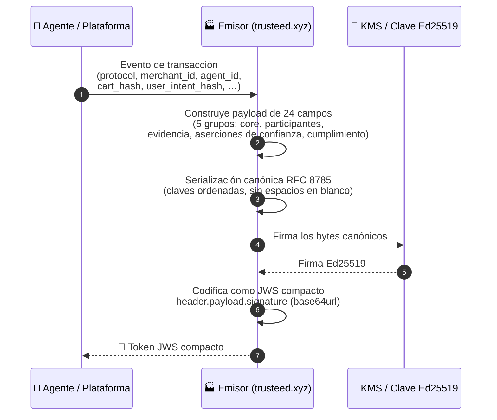
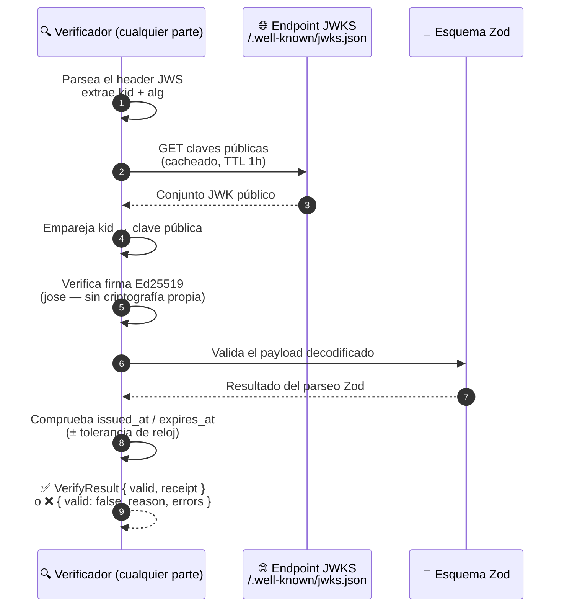
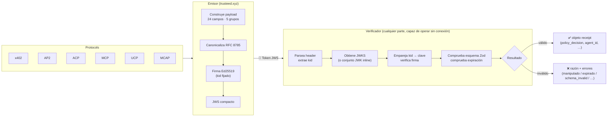

<!-- generated-by: gsd-doc-writer -->

[English](README.md) | **Español** | [Français](README.fr.md) | [Deutsch](README.de.md)

# TrustReceipt

**Capa de evidencia del lado del comercio para el comercio agéntico — firmada, portátil, verificable sin conexión**

[](SPEC.md)
[](LICENSE)
[](https://www.npmjs.com/package/trust-receipt-verifier)
[](https://github.com/trust-receipt/spec)

---

## Qué es

TrustReceipt es un formato de recibo abierto, orientado al comercio, para evidencia de comercio agéntico verificable sin conexión a través de protocolos como ACP, AP2, x402, MCP, UCP y MCAP. Es **compatible con protocolos, no competidor de protocolos**: en lugar de reemplazar los mandatos de AP2, las sesiones de checkout de ACP, las firmas de Visa TAP o las liquidaciones de x402, produce un registro criptográfico portátil de la decisión de política aplicada a ellos.

Un TrustReceipt es un payload JSON firmado con JWS, verificable sin conexión contra un endpoint JWKS público. Cada recibo registra quién era el agente, qué protocolo se ejecutó, qué proveedores de confianza avalaron la transacción, qué política se aplicó y qué decisión se tomó — todo en un único token autocontenido que cualquier parte puede verificar sin llamar al emisor.

Este paquete es la implementación **de referencia del verificador y emisor**. Forma parte del stack de control del comercio de Trusteed (instantáneas de política + puntos de control de agentes + recibos), pero el formato de recibo en sí es abierto y portátil entre emisores.

---

## Estado de capacidades

| Capacidad                                               | Estado                              | Notas                                                                                 |
| -------------------------------------------------------- | ------------------------------------ | -------------------------------------------------------------------------------------- |
| Verificación JWS (Ed25519)                               | ✅ Implementado                      | CLI + librería, sin criptografía propia (usa `jose` v6)                              |
| Resolución de clave pública basada en JWKS                | ✅ Implementado                      | Fetch cacheado con TTL; también soporta un conjunto JWK inline                        |
| Esquema v1.0                                              | ✅ Estable                           | 10 vectores de conformidad pasando                                                    |
| Esquema v1.1 (campos alineados con eIDAS)                | 🟡 Código completo / experimental    | 11 vectores adicionales pasando; el conjunto de campos puede evolucionar antes de v1.2 |
| JSON canónico RFC 8785                                   | ✅ Implementado                      | Usado para firmar + hashes de la cadena de auditoría                                  |
| Cadena de auditoría (`hash_chain_prev`)                  | ✅ Implementado                      | Enlace a prueba de manipulación por comerciante                                       |
| Postura de sello electrónico avanzado eIDAS               | 🟡 Candidato                         | Soporte a nivel de campo; **no** es un Sello Electrónico Cualificado (sin QTSP)       |
| Forma de evidencia ESIGN / UETA                          | 🟡 Parcial                           | `esign_disclosure_hash` + contexto de consentimiento; flujo completo de divulgación en progreso |
| Evidencia de sello de tiempo confiable RFC 3161          | 🟡 Opcional / dependiente de integración | Hook presente vía `trust-receipt-tsa-client`; depende del proveedor de TSA            |
| Firma del lado del emisor con AWS KMS                    | 🟡 Opcional / del lado del emisor    | Provisto por el paquete hermano `trust-receipt-kms-signer`; no requerido para verificar |
| Ports de referencia (TS) / ports a otros lenguajes (Python, Go, Java) | 🟡 Solo TS por ahora      | Se aceptan ports — ver `CONTRIBUTING.md`                                              |
| Exportación/verificación de proof-bundle AIVS (`aivs-export.ts`) | 🟡 Código completo            | Proyecta un recibo v1.0 firmado en un bundle compatible con AIVS `{ manifest_hash, session_sig, audit_log }` — verificable sin conexión sin código de Trusteed (spec-062 US1, alineación, no custodia/escrow) |
| Verificación de artefactos de extensión (`verify-extension-artifact.ts`) | 🟡 Código completo    | Verifica recibos de borrado firmados por el desarrollador y manifiestos de extensión del ecosistema del Trusteed Extension Marketplace |
| Forma compacta v1.0-legacy del recibo (`verifier.ts`)     | ✅ Implementado                      | `verifyTrustReceipt` también acepta el payload compacto estilo JWT emitido por el emisor de la plataforma desde spec-040; expuesto como `result.variant` / `result.legacyReceipt` |

> ✅ = implementación de grado producción. 🟡 = presente y testeado pero sujeto a cambios antes de la GA de v1.2, o dependiente de integración del lado del operador.

---

## Cómo funciona

Un TrustReceipt fluye a través de dos operaciones independientes — **emisión** y **verificación** — que pueden ejecutarse en sistemas distintos en momentos distintos, sin necesidad de un secreto compartido.

### Emisión de un recibo



### Verificación de un recibo



### Panorama completo



**Propiedades clave:**

- **Capaz de operar sin conexión** — la verificación solo necesita la URL del JWKS (cacheada públicamente); no hay llamada de vuelta al emisor
- **Agnóstico de protocolo** — un único formato de recibo cubre x402, AP2, ACP, MCP, UCP y MCAP vía `protocol_artifacts`
- **Encadenable para auditoría** — `hash_chain_prev` enlaza recibos en una cadena por comerciante a prueba de manipulación (RFC 8785)
- **Consciente de la jurisdicción** — `legal_posture` registra la postura de cumplimiento eIDAS / ESIGN / UK-DIATF por recibo

---

## Aviso Legal

> Sello verificable para el comercio agéntico. Cada TrustReceipt genera evidencia criptográfica portátil de origen, integridad, consentimiento, autorización del agente y retención auditable.
> Diseñado para ser compatible con ESIGN/UETA en EE. UU., con eIDAS en la UE como evidencia candidata de sello electrónico avanzado, y con el marco británico de Firmas Electrónicas y Servicios de Confianza (UK Electronic Signatures and Trust Services).
> Los sellos/firmas cualificados requieren emisión o validación por un QTSP aplicable.

> **Descargo de responsabilidad**: TrustReceipt es evidencia técnica verificable criptográficamente. No determina por sí misma la responsabilidad legal. Que un recibo determinado sea admisible o persuasivo en una jurisdicción o procedimiento concreto depende de la ley local aplicable, de los acuerdos entre las partes consintientes, y de otros hechos fuera del alcance de este formato de registro.

_Ver [docs/legal/trust-receipt-claims-policy.md](../../docs/legal/trust-receipt-claims-policy.md) para la política de declaraciones completa._

### Estado de Compatibilidad Regulatoria

| Marco normativo                                | Jurisdicción | Estado                                                                                                                                                                                                                        | Campos v1.1                                                                                                  |
| ----------------------------------------------- | ------------ | ----------------------------------------------------------------------------------------------------------------------------------------------------------------------------------------------------------------------------- | -------------------------------------------------------------------------------------------------------------- |
| **eIDAS** (Reglamento 910/2014)                | UE           | 🟡 Candidato — `legal_posture` progresa `ades_candidate_no_tsa` → `ades_candidate_timestamped` → `ades_candidate_kms`. El sello cualificado (QeSeal) requiere un QTSP.                                                       | `legal_posture`, `legal_posture_warnings`, `timestamp_evidence`, `esign_disclosure_hash`                     |
| **ESIGN / UETA**                               | EE. UU.      | 🟡 Parcial — Sello verificable con evidencia de consentimiento, atribución del agente, divulgación versionada y retención auditable, diseñado para respaldar ESIGN/UETA. El flujo completo de divulgación (URI de retirada, fijación de versión) está en progreso. | `esign_disclosure_hash`, `consent_context.consent_disclosure_version`, `consent_context.withdrawal_uri_hash` |
| **Electronic Communications Act 2000 / DIATF** | Reino Unido  | 🟡 Compatible a nivel de esquema — la retención consciente de la jurisdicción (Reino Unido: 7 años por defecto) y el campo `legal_posture` transportan evidencia de servicios de confianza del Reino Unido. La alineación con DIATF está verificada a nivel de esquema; la certificación operativa está pendiente. | `legal_posture`, `privacy_classification.jurisdiction`, `export_bundle.retention_policy`                     |

> ⚠️ Nada de lo anterior constituye asesoramiento legal. El estado de calificación regulatoria puede cambiar a medida que evoluciona la implementación. Consulte con asesoría legal cualificada para requisitos específicos de cada jurisdicción.

---

## Verificación rápida

```bash
npm install trust-receipt-verifier
```

**Recibo v1.0 (JWS compacto):**

```typescript
import { verifyTrustReceipt } from "trust-receipt-verifier";

const result = await verifyTrustReceipt(jwsToken, {
  jwksUrl: "https://trusteed.xyz/.well-known/jwks.json",
});

if (result.valid) {
  console.log(result.receipt.policy_decision); // "allow"
} else {
  console.error(result.reason, result.errors);
}
```

**Envoltorio v1.1 (`receipt` + `envelope_metadata` + sidecars opcionales):**

```typescript
import { verifyReceiptEnvelope } from "trust-receipt-verifier";
import type { VerifyOptions } from "trust-receipt-verifier";

const opts: VerifyOptions = {
  jwksHistory: {
    jws_compact: "<SignedJwksHistory JWS>",
    signed_by_root_sha256: "<issuer-root-sha256>",
  },
  trustAnchorPemSha256: "dd43bf2cd65023d79e41358226ed1197fcea36bc693f1c0fadde0e318bfd76a1",
  policyOidAllowlist: ["1.2.3.4.5.6.7.8.9"],
  // toleranceSeconds: 30,  // tolerancia de deriva de reloj por defecto (segundos)
  // mode: "strict",        // por defecto "compat" — ver "Modo estricto vs compat" más abajo
  // allowStagingRoots: true, // solo staging/CI — nunca establecer en producción
};

const result = await verifyReceiptEnvelope(envelope, opts);

if (result.outcome === "accepted") {
  console.log(result.recomputedLegalPosture); // "ades_candidate_timestamped"
  if (result.warnings.includes("unknown_trust_provider_present")) {
    // el envoltorio referencia un proveedor de confianza aún no reconocido por esta versión del verificador
  }
} else {
  console.error(result.errorCode, result.detail);
  // errorCode puede ser: "receipt_expired" | "receipt_not_yet_valid" |
  // "jwks_history_signature_invalid" | "unknown_kid" | "schema_invalid" | …
}
```

> **`allowStagingRoots`**: por defecto es `false`. Cuando es `false` (por defecto en producción), cualquier `jwksHistory.signed_by_root_sha256` que no esté presente en la lista de anclas de confianza embebida provoca rechazo inmediato (`jwks_history_signature_invalid`). Establecer a `true` solo en entornos de staging o CI que usen bundles de historial JWKS sin firmar/stub.

---

## Anatomía del recibo

Un payload de TrustReceipt contiene 24 campos agrupados en cinco grupos:

**Core**

| Campo             | Tipo         | Descripción                   |
| ----------------- | ------------ | ------------------------------ |
| `receipt_id`     | UUID v4      | Identificador único del recibo |
| `schema_version` | `"1.0"`      | Literal de versión del esquema |
| `issued_at`      | Segundos Unix | Cuándo se creó el recibo       |
| `expires_at`     | Segundos Unix | Cuándo expira el recibo        |
| `issuer`         | string       | Dominio de la plataforma emisora |

**Participantes**

| Campo             | Tipo   | Descripción                                        |
| ----------------- | ------ | ---------------------------------------------------- |
| `merchant_id`    | string | Identificador del comerciante                         |
| `agent_id`       | string | Identificador de sesión o instancia del agente        |
| `agent_provider` | string | Proveedor de IA (`anthropic`, `openai`, `google`, …) |

**Evidencia de Transacción**

| Campo                 | Tipo               | Descripción                                                                              |
| --------------------- | ------------------ | ------------------------------------------------------------------------------------------ |
| `user_intent_hash`   | string (no vacío)  | Hash de la intención original del usuario — debe ser no vacío (se recomienda SHA-256 hex) |
| `cart_hash`          | SHA-256 hex        | Hash del contenido del carrito en el momento de la decisión (opcional)                     |
| `order_hash`         | SHA-256 hex        | Hash del objeto de pedido liquidado (opcional)                                              |
| `transaction_id`     | string             | Referencia de transacción de la plataforma (opcional)                                       |
| `protocol`           | enum               | `x402 \| AP2 \| ACP \| MCP \| UCP \| MCAP`                                                  |
| `protocol_artifacts` | array              | Hashes de objetos de evidencia específicos del protocolo                                    |
| `payment_reference`  | object             | Nombre del PSP + referencia, sin datos de pago en crudo (opcional)                          |

**Aserciones de Confianza**

| Campo                       | Tipo  | Descripción                                                   |
| ---------------------------- | ----- | ----------------------------------------------------------------- |
| `risk_signals`              | array | Señales normalizadas del emisor o de proveedores                  |
| `trust_provider_assertions` | array | Aserciones puntuadas de ClearSale, Trulioo, Mastercard, etc.      |
| `policy_decision`           | enum  | `allow \| deny \| review \| challenge`                            |

**Cumplimiento**

| Campo                     | Tipo        | Descripción                                                        |
| -------------------------- | ----------- | --------------------------------------------------------------------- |
| `liability_context`      | object      | Asertor y alcance (opcional)                                          |
| `consent_context`        | object      | Hash de consentimiento, alcance, timestamp (opcional)                 |
| `privacy_classification` | object      | Bandera PII, días de retención, jurisdicción (opcional)                |
| `verification_methods`   | array       | URL JWKS o DID para resolución de clave — se requiere al menos una entrada |
| `kid`                    | string      | ID de clave usado para firmar este recibo                             |
| `hash_chain_prev`        | SHA-256 hex | Recibo anterior en la cadena de auditoría (opcional)                   |
| `attachments`            | array       | Referencias de archivo nombradas y con hash (opcional)                 |

---

## Soporte de protocolos

| Protocolo                                                                                                  | Mapeo de artefactos | Tipos de artefacto principales                            |
| ------------------------------------------------------------------------------------------------------------ | -------------------- | ------------------------------------------------------------ |
| [MCAP](https://developer.mastercard.com/mastercard-checkout-solutions/documentation/use-cases/agent-pay/) | Definido             | `mcap_consent_hash`, `mcap_nonce`                             |
| [x402](https://github.com/x402-foundation/x402)                                                           | Definido             | `permit2_hash`, `settlement_hash`, `upto_envelope_hash`       |
| [AP2](https://github.com/google-agentic-commerce/AP2)                                                     | Definido             | `mandate_hash`, `ap2_consent_hash`                            |
| [MCP](https://modelcontextprotocol.io)                                                                    | Definido             | `mcp_call_hash`, `tool_call_hash`                             |
| [ACP](https://github.com/agentic-commerce-protocol/agentic-commerce-protocol)                             | Definido             | `acp_session_hash`, `acp_policy_hash`                         |
| [UCP](https://github.com/Universal-Commerce-Protocol/ucp)                                                 | Definido             | `ucp_token_hash`                                              |

---

## Conformidad

Una implementación de verificador debe pasar los 10 vectores de prueba (v1.0) para reclamar conformidad con TrustReceipt. Se definen tres niveles:

> **Estado v1.1 (2026-05-06)** — el endurecimiento eIDAS añade 11 vectores v1.1 en `test-vectors/v11/`. El esquema v1.1 elimina los campos legacy `mandate_hash` / `permit2` / `mcp` de rail e introduce `payment_authorization_hash`, `authorization_scheme`, `legal_posture_warnings` y `esign_disclosure_hash`. Suite combinada 58/58 pasando.

| Nivel | Nombre    | Requisito                                                                  |
| ----- | --------- | ------------------------------------------------------------------------------ |
| 1     | Verifier  | Pasa los 10 vectores de prueba                                                  |
| 2     | Issuer    | Nivel 1 + emite correctamente recibos válidos                                   |
| 3     | Provider  | Nivel 2 + coautoría de ≥1 tipo de `trust_provider_assertions` con datos reales |

Esta implementación de referencia es conformante de Nivel 2. Hay dos formas de ejecutar la suite de conformidad:

**(a) Tests unitarios** — verifica los 10 vectores usando infraestructura de test preconstruida (10 tests):

```bash
pnpm test
```

**(b) Conformidad JWS de extremo a extremo** — genera un par de claves nuevo, firma los 10 vectores, llama a `verifyTrustReceipt`, y reporta pass/fail por vector:

```bash
# Vía CLI (requiere que el paquete esté compilado primero)
trust-receipt conformance

# O directamente con tsx (sin necesidad de compilar)
npx tsx scripts/validate-vectors.ts
```

Añade el badge a tu proyecto una vez que los 10 pasen:

```markdown
[](https://github.com/trust-receipt/spec)
```

---

## Estructura del repositorio

```
trust-receipt-verifier/
├── SPEC.md                            — especificación formal (autoritativa)
├── CONTRIBUTING.md                    — cómo contribuir vectores, ports y esquemas de proveedor
├── LICENSE                            — MIT
├── src/
│   ├── index.ts                       — exports del paquete
│   ├── verifier.ts                    — verifyTrustReceipt() + parseTrustReceiptUnsafe() (v1.0, incl. forma legacy-compact)
│   ├── verify-1.0.ts                  — internos del verificador v1.0
│   ├── verify-1.1.ts                  — verifyReceiptEnvelope() (envoltorio v1.1 eIDAS) + predicados tipados de proveedor de confianza
│   ├── zod-1.1.ts                     — esquema Zod v1.1 (raíz estricta — rechaza claves de nivel superior desconocidas)
│   ├── types-1.1.ts                   — formas tipadas de aserción de proveedor de confianza
│   ├── issuer.ts                       — issueTrustReceipt()
│   ├── embedded-issuer-root.ts        — ancla de confianza en tiempo de compilación + validateChain()
│   ├── verify-jwks-history.ts         — verificación de la cadena de historial JWKS
│   ├── verify-timestamp-evidence.ts   — verificación de sello de tiempo RFC 3161
│   ├── verify-export-bundle.ts        — verificación de bundle de exportación sin conexión
│   ├── verify-extension-artifact.ts   — verificación de recibo de borrado / manifiesto de extensión (Extension Marketplace)
│   ├── aivs-export.ts                 — exportación/verificación de proof-bundle AIVS (spec-062 US1)
│   ├── __tests__/                     — tests unitarios + de conformidad
│   └── schema/
│       ├── trust-receipt.schema.ts        — esquema Zod (fuente de verdad para los tipos TypeScript v1.0)
│       └── trust-receipt-legacy.schema.ts — forma compacta v1.0-legacy (emitida por la plataforma desde spec-040)
├── test-vectors/
│   ├── README.md                    — cómo usar los vectores
│   ├── vectors.json                 — manifiesto de vectores con resultados esperados
│   ├── valid/                       — TC-001 a TC-005
│   ├── invalid/                     — TC-006 a TC-010
│   └── v11/, v11-strict/            — vectores de conformidad v1.1 + modo estricto
├── bin/
│   └── trust-receipt.ts (fuente) → dist/bin/trust-receipt.js (compilado) — CLI: verify, inspect, generate-key, conformance
└── demo/                            — scripts de demostración ejecutables
```

---

## Emitir un recibo

```typescript
import { issueTrustReceipt } from "trust-receipt-verifier";

const jws = await issueTrustReceipt({
  payload: {
    issuer: "trusteed.xyz",
    merchant_id: "merchant-001",
    agent_id: "agent-session-xyz",
    agent_provider: "anthropic",
    user_intent_hash: "<sha256-hex-of-user-intent>",
    protocol: "MCP",
    protocol_artifacts: [{ type: "mcp_call_hash", hash: "<sha256-hex>" }],
    policy_decision: "allow",
    verification_methods: [
      { type: "jwks", value: "https://trusteed.xyz/.well-known/jwks.json" },
    ],
    kid: "tr-ed25519-2026-04-29",
  },
  privateKeyJwk: myEd25519PrivateKey,
  kid: "tr-ed25519-2026-04-29",
});
```

> **Canonicalización**: el payload se serializa con RFC 8785 (claves ordenadas, sin whitespace) antes de firmar, garantizando que `SHA-256(payload)` sea idéntico en cualquier implementación conforme.

## Verificadores de artefactos relacionados

**Exportación de proof-bundle AIVS** — proyecta un recibo v1.0 firmado en un bundle compatible con AIVS (`draft-stone-aivs-00`), verificable sin conexión con solo el JWS y el JWKS del emisor:

```typescript
import { exportAivsProofBundle, verifyAivsProofBundle } from "trust-receipt-verifier";

const bundle = exportAivsProofBundle(receiptJws); // { manifest_hash, session_sig, kid, alg, audit_log }
const result = await verifyAivsProofBundle(bundle, { jwks: issuerJwks });
```

**Artefactos del Extension Marketplace** — verifica recibos de borrado firmados por el desarrollador (prueba de destrucción de datos post-desinstalación) o manifiestos de extensión:

```typescript
import { verifyExtensionArtifact } from "trust-receipt-verifier";

const result = await verifyExtensionArtifact(jws, {
  kind: "erasure", // o "manifest" — quien llama indica qué artefacto es
  jwksUrl: "https://trusteed.xyz/.well-known/jwks.json",
});
// result.valid: boolean; result.reason en caso de fallo ("malformed_jws" | "unsupported_alg" | "missing_kid" | "jwks_unreachable" | "kid_not_found" | "signature_invalid" | "payload_not_json" | "shape_invalid")
```

## CLI

```bash
# Genera un par de claves Ed25519
trust-receipt generate-key

# Verifica un recibo v1.0 (JWS compacto)
trust-receipt verify receipt.jws --jwks-url https://trusteed.xyz/.well-known/jwks.json

# Verifica un envoltorio v1.1 (objeto JSON con `receipt` + `envelope_metadata`)
trust-receipt verify envelope.json \
  --type receipt-v11 \
  --jwks-history-file issuer-jwks-history.json \
  --trust-anchor-sha256 dd43bf2cd65023d79e41358226ed1197fcea36bc693f1c0fadde0e318bfd76a1 \
  --policy-oid 1.2.3.4.5.6.7.8.9

# Verifica un envoltorio v1.1 en modo ESTRICTO (aplicación semántica del ancla de confianza)
trust-receipt verify envelope.json \
  --type receipt-v11 \
  --jwks-history-file issuer-jwks-history.json \
  --trust-anchor-sha256 dd43bf2cd65023d79e41358226ed1197fcea36bc693f1c0fadde0e318bfd76a1 \
  --strict

# Solo staging / CI — omite la comprobación del ancla raíz (nunca usar en producción)
trust-receipt verify envelope.json --type receipt-v11 \
  --jwks-history-file issuer-jwks-history.json \
  --trust-anchor-sha256 <sha256> \
  --allow-staging-roots

# Inspecciona un recibo sin verificar la firma
trust-receipt inspect receipt.jws

# Ejecuta la suite de conformidad completa de extremo a extremo (firma + verifica los 10 vectores)
trust-receipt conformance
```

> **Autodetección de `--type`**: cuando se omite `--type`, la CLI inspecciona la forma de la entrada. Un objeto JSON con las claves `receipt` y `envelope_metadata` se trata automáticamente como `receipt-v11`; una cadena compacta `header.payload.sig` se trata como `receipt` (v1.0). `--type` también acepta `erasure`, `manifest` y `jwks-history` para los verificadores de artefactos descritos arriba — pásalo explícitamente cuando la autodetección sea ambigua (tanto los payloads erasure como manifest son JWS compactos sin claves `receipt`/`envelope_metadata`).

---

## Modo de verificación estricto vs compat (v1.1)

El verificador v1.1 valida `verification_methods.trust_anchor_sha256` y
`verification_methods.jwks_sha256` solo por **formato regex** (64 caracteres hex) en
la capa de esquema. Esa sola comprobación de formato permite que un ancla
**stub opaca** (todo ceros / un solo nibble) pase — está bien formada estructuralmente
pero no lleva ninguna vinculación real a la cadena de confianza (los emisores emiten
tales stubs antes de una ceremonia de ancla de producción). La opción `mode` (librería) /
el flag `--strict` (CLI) añade la capa **semántica**:

| Condición                                                           | `compat` (por defecto — canary)      | `strict`                                    |
| ------------------------------------------------------------------- | ------------------------------------- | ---------------------------------------------|
| `trust_anchor_sha256` es un stub opaco (todo ceros / un solo nibble) | advierte `trust_anchor_sha256_stub`   | rechaza `trust_anchor_stub_rejected`         |
| `jwks_sha256` es un stub opaco                                      | advierte `jwks_sha256_stub`           | rechaza `jwks_sha256_stub_rejected`          |
| `trust_anchor_sha256` ≠ `trustAnchorPemSha256` fijado por el operador | advierte `trust_anchor_sha256_mismatch` | rechaza `trust_anchor_mismatch`              |
| recibo buyer_agent sin vinculación de identidad de agente            | advierte `agent_identity_absent`      | rechaza `agent_identity_required_strict`     |
| sello de tiempo RFC 3161 / LOTL degradado (p. ej. TSA no disponible) | advierte (`tsa_unavailable`)          | advierte (`tsa_unavailable`) — aceptado en AMBOS |

`compat` es el valor por defecto para que el despliegue no sea disruptivo mientras se
acumula observabilidad; cambia a `strict` una vez que los emisores hayan completado la
ceremonia de ancla de producción. Los cuatro vectores de conformidad negativos nombrados
viven en `test-vectors/v11-strict/` y se regeneran con
`scripts/generate-strict-mode-vectors.ts`.

```ts
// Uso de librería
import { verifyReceiptEnvelope } from "trust-receipt-verifier";

const result = await verifyReceiptEnvelope(envelope, {
  jwksHistory,
  trustAnchorPemSha256: "<64-hex-pinned-anchor>",
  policyOidAllowlist: ["1.2.3.4.5.6.7.8.9"],
  mode: "strict", // por defecto es "compat"
});
```

---

## Documentación

| Documento                                     | Descripción                                                                                            |
| ----------------------------------------------- | ---------------------------------------------------------------------------------------------------------- |
| [SPEC.md](SPEC.md)                            | Especificación formal — formato wire, referencia de campos, reglas de conformidad                          |
| [docs/architecture.md](docs/architecture.md)  | Arquitectura interna — envoltorio de firma, resolución de clave, pipeline de verificación, propiedades de seguridad |
| [CONTRIBUTING.md](CONTRIBUTING.md)            | Cómo añadir vectores de conformidad, ports a otros lenguajes, o esquemas de proveedor de confianza          |
| [CHANGELOG.md](CHANGELOG.md)                  | Historial de versiones y cambios disruptivos                                                                |

---

## Contribuir

Ver [CONTRIBUTING.md](CONTRIBUTING.md) para cómo añadir vectores de conformidad, portar el verificador a otro lenguaje, o coautorizar un esquema de `trust_provider_assertions` como socio proveedor de confianza.

---

## Lo que un TrustReceipt NO prueba

Un recibo es evidencia técnica, no prueba legal ni garantía operativa. Deliberadamente **no** afirma:

- **Que el pago fue capturado o liquidado.** Un recibo con `policy_decision: "allow"` registra la decisión y la intención. La liquidación queda registrada por el PSP / rail subyacente (cargo de Stripe, tx on-chain de x402, finalización de ACP, etc.) y se referencia vía `payment_reference` o `protocol_artifacts`, no por el recibo en sí.
- **Que los bienes o servicios fueron entregados.** La evidencia de cumplimiento vive en el sistema de pedidos del comerciante.
- **Cumplimiento de KYC / KYA.** Un recibo registra que un proveedor de confianza afirmó un nivel (p. ej. `kya_status`) en el momento de la emisión. No sustituye una verificación KYC/KYA independiente.
- **Estado de Sello Electrónico Cualificado eIDAS.** Incluso con `legal_posture` poblado, un TrustReceipt es, como mucho, un candidato a Sello Electrónico **Avanzado**. Los sellos cualificados requieren emisión por un QTSP listado en la UE, lo cual está fuera del alcance de este paquete.
- **Responsabilidad legal o admisibilidad.** Un recibo es evidencia criptográfica. Que sea admisible o persuasivo en una jurisdicción específica depende de la ley local, los acuerdos entre las partes, y hechos fuera del alcance del formato del recibo.
- **Que el usuario realmente pretendía lo que el agente hizo.** El recibo registra `user_intent_hash` — es decir, que existió un texto de intención y fue hasheado — no que el hash coincida con una expresión humana verificada.

Si tu caso de uso necesita alguna de las garantías anteriores, el recibo es un primitivo de auditoría útil _junto a_ esos mecanismos, no un sustituto de ellos.

---

## Modelo de amenazas

El verificador está diseñado para detectar las siguientes clases de manipulación. Para cada una, el verificador devuelve un `{ valid: false, reason }` estructurado en lugar de lanzar una excepción.

| Amenaza                                | Defensa                                                                                                                    | Comportamiento del verificador (v1.0 / v1.1)                                                  |
| ---------------------------------------- | ------------------------------------------------------------------------------------------------------------------------------- | --------------------------------------------------------------------------------------------------- |
| Falsificación de firma / manipulación de payload | Ed25519 sobre bytes canónicos RFC 8785; `kid` fijado en el header y en el payload                                            | `"signature_invalid"` / `"signature_invalid"`                                                       |
| Clave incorrecta usada para firmar     | Discrepancia de `kid` entre el header JWS y la entrada JWKS                                                                     | `"kid_not_found"` / `"unknown_kid"`                                                                 |
| Recibo expirado                        | `expires_at` comprobado contra el reloj del verificador con tolerancia configurable (por defecto ±30 s)                       | `"expired"` / `"receipt_expired"`                                                                    |
| Recibo emitido en el futuro             | `issued_at` comprobado contra el reloj del verificador con la misma tolerancia                                                  | `"not_yet_valid"` / `"receipt_not_yet_valid"`                                                       |
| Downgrade de esquema / campos desconocidos | Validación de esquema Zod estricta sobre campos conocidos; claves desconocidas de nivel superior rechazadas                     | `"schema_invalid"` / `"schema_invalid"`                                                             |
| Historial JWKS falsificado / sin firmar | `jwksHistory.signed_by_root_sha256` debe coincidir con un ancla de confianza embebida; fallo estricto si es desconocido salvo `allowStagingRoot` | n/a (v1.0) / `"jwks_history_signature_invalid"`                                                     |
| Aserción de proveedor de confianza desconocido | El verificador advierte pero no rechaza, preservando la compatibilidad hacia adelante                                          | n/a (v1.0) / advertencia `"unknown_trust_provider_present"`                                          |
| Repetición (replay) de un recibo antiguo | **Fuera del alcance del verificador por sí solo.** Los consumidores deben forzar la unicidad vía `receipt_id` + `issued_at` + reglas de negocio | n/a — el verificador devuelve `valid: true` / `outcome: "accepted"` para réplicas aún no expiradas |
| Rotación de JWKS mientras un recibo está vivo | El fetch de JWKS se refresca cuando hay un miss de `kid`; las claves antiguas pueden conservarse en el conjunto JWKS durante la ventana de gracia de rotación | Verifica mientras el `kid` siga publicado                                                            |
| Clave del emisor comprometida           | La revocación de claves es responsabilidad del operador: quitar el `kid` del conjunto JWKS; los verificadores fallarán en modo cerrado | `"kid_not_found"` / `"unknown_kid"` una vez eliminada                                               |
| Deriva de reloj entre emisor/verificador | Opción `toleranceSeconds` (por defecto 30 s)                                                                                    | Dentro de la tolerancia: pasa. Fuera: `"expired"` / `"receipt_expired"` o `"receipt_not_yet_valid"` |
| MITM en el endpoint JWKS                | El TLS hacia el host JWKS es responsabilidad del operador; fijar la URL del JWKS fuera de banda defiende contra sustitución maliciosa | n/a — el verificador confía en la URL configurada                                                   |

**No-objetivos.** El verificador **no** valida: (a) si el pago subyacente se liquidó, (b) si la política del comerciante estaba correctamente configurada, (c) la admisibilidad jurisdiccional, (d) listas de revocación externas al endpoint JWKS, o (e) evidencia específica del protocolo dentro de `protocol_artifacts` (esas son validadas por quien llama contra la especificación del protocolo correspondiente).

---

## Política de versionado

Este paquete sigue **Versionado Semántico** respecto a la API pública _y_ al formato wire del recibo.

| Tipo de cambio                                      | Bump   | Compatibilidad                                                                                            |
| ------------------------------------------------------ | ------ | ---------------------------------------------------------------------------------------------------------- |
| Añadir campo opcional al payload                       | minor  | Los verificadores antiguos ignoran campos desconocidos **solo si** el campo está espaciado de nombres o explícitamente marcado como opcional |
| Añadir campo obligatorio al payload                     | major  | Los verificadores antiguos rechazarán — se requiere un corte coordinado                                     |
| Eliminar o renombrar campo del payload                  | major  | Disruptivo — los emisores deben seguir emitiendo recibos v1.x hasta que la población de verificadores se ponga al día |
| Añadir nuevo valor al enum `protocol`                   | minor  | Los verificadores antiguos rechazarán valores de enum desconocidos; emitir solo después de que el ecosistema de verificadores lo soporte |
| Endurecer una restricción Zod (p. ej. formato, longitud) | minor  | Compatible hacia atrás en tiempo de parseo; la nueva restricción es solo hacia adelante                     |
| Cambio de API de la librería del verificador (firma de función) | major  | El código llamador debe actualizarse                                                                        |
| Cambio de API de la librería del verificador (nuevo argumento opcional) | minor  | Los llamadores existentes no se ven afectados                                                               |

**Verificación entre versiones.** El verificador v1.1.x verifica recibos emitidos bajo el esquema v1.0 _y_ el esquema v1.1. Los recibos v1.0 simplemente carecerán de campos v1.1 (`legal_posture`, `consent_context`, etc.) y el verificador los trata como opcionales. No hay plan de eliminar la verificación de v1.0 en ninguna versión v1.x — eliminarla requiere un bump mayor a v2.0 y una ventana de deprecación de al menos 12 meses.

**Campo `schema_version`.** Los recibos llevan `schema_version: "1.0"` o `schema_version: "1.1"`. El verificador despacha la validación del esquema según este campo. Los recibos sin `schema_version` son rechazados (`reason: "schema_invalid"`).

---

## Agradecimientos

TrustReceipt es un formato de evidencia entre protocolos. Las siguientes partes externas definen esquemas, protocolos o infraestructura a los que los recibos de TrustReceipt pueden referenciar o atestiguar. Ninguna de estas organizaciones es colaboradora formal de este repositorio; las relaciones son integraciones de interoperabilidad, no endosos.

### Autores de protocolo (definen campos del esquema)

| Protocolo | Autor | Campo de esquema de TrustReceipt |
| ---------- | ------ | ----------------------------------- |
| [ACP (Agentic Commerce Protocol)](https://github.com/agentcommerceprotocol/acp) | [OpenAI](https://openai.com) + [Stripe](https://stripe.com) | `authorization_scheme: "acp_session_token"`, `protocol: "ACP"` |
| [AP2 (Agent Payment Protocol v2)](https://developers.google.com/wallet) | [Google](https://google.com) | `authorization_scheme: "ap2_mandate_jws"`, `protocol: "AP2"`, `ap2_consent_hash` |
| [x402 (pago en stablecoin)](https://github.com/x402-foundation/x402) | [Coinbase](https://coinbase.com) + [Cloudflare](https://cloudflare.com) | `authorization_scheme: "evm_permit2" / "svm_token_authorization" / "x402_native"`, `protocol: "x402"` |
| [MCAP (Mastercard Agent Pay)](https://developer.mastercard.com/product/agent-pay/) | [Mastercard](https://mastercard.com) | `authorization_scheme: "mcap_cart_binding"`, `protocol: "MCAP"`, `mcap_consent_hash` |
| [MCP (Model Context Protocol)](https://github.com/modelcontextprotocol/specification) | [Anthropic](https://anthropic.com) | `authorization_scheme: "mcp_tool_invocation"`, `protocol: "MCP"` |
| [UCP (Universal Commerce Protocol)](https://github.com/Universal-Commerce-Protocol/ucp) | [Google](https://google.com) | `authorization_scheme: "ucp_rule_set_plus_agent_token"`, `protocol: "UCP"` |

### Proveedores activos en runtime (cableados en `trust_provider_assertions[]`)

Estos proveedores producen aserciones estructuradas que la lógica `recomputeLegalPosture` en `verify-1.1.ts` lee al determinar el `LegalPosture` autoritativo del verificador. Usa los predicados de tipo exportados (`isRfc9421ProviderAssertion`, `isHumanProviderAssertion`, `isVisaTapProviderAssertion`) para estrechar hacia las formas tipadas definidas en `types-1.1.ts`.

| Proveedor | Campo `provider` de la aserción | Integración |
| ---------- | -------------------------------- | ------------- |
| [IETF RFC 9421](https://www.rfc-editor.org/rfc/rfc9421) (HTTP Message Signatures) | `"rfc9421-native"` | Verifica firmas de mensajes HTTP de cualquier agente con un endpoint JWKS público; el emisor lo cablea de forma opcional |
| [HUMAN Security — AgenticTrust](https://www.humansecurity.com/agentictrust) | `"human"` | Integración opcional de identidad de agente; ningún SDK de HUMAN se importa en este paquete verificador |
| [Visa TAP](https://developer.visa.com/) (Trusted Agent Protocol) | `"visa"` | Validado cuando el dominio del firmante es `*.visa.com` o `*.visa.net` con tag `"agent-browser-auth"` o `"agent-payer-auth"` |

### Infraestructura del lado del emisor (no usada por este paquete verificador)

| Herramienta | Rol |
| ------------ | ---- |
| [freeTSA](https://freetsa.org/) | Autoridad de sello de tiempo RFC 3161 por defecto de la Fase 1; la URL es por recibo (campo `tsa_endpoint`) — no está fijada aquí |
| [AWS KMS](https://aws.amazon.com/kms/) | Claves de firma Ed25519 del emisor y CMKs HMAC para hashes derivados de PII; gestionado por el paquete hermano `trust-receipt-kms-signer` |

---

## Aviso de Marca Registrada

TrustReceipt no está afiliado con, respaldado por, ni oficialmente soportado por Mastercard, Anthropic, Skyfire, Coinbase, HUMAN Security, Visa, ni ningún otro propietario de protocolo o empresa nombrada referenciada en esta especificación. Los nombres de protocolo (AP2, MCAP, ACP, MCP, x402, UCP) se usan de forma descriptiva para indicar únicamente objetivos de interoperabilidad. Todas las marcas comerciales y marcas registradas son propiedad de sus respectivos dueños.

---

## Licencia

MIT — ver [LICENSE](LICENSE). Copyright MCPWebStore (trusteed.xyz), 2026.
