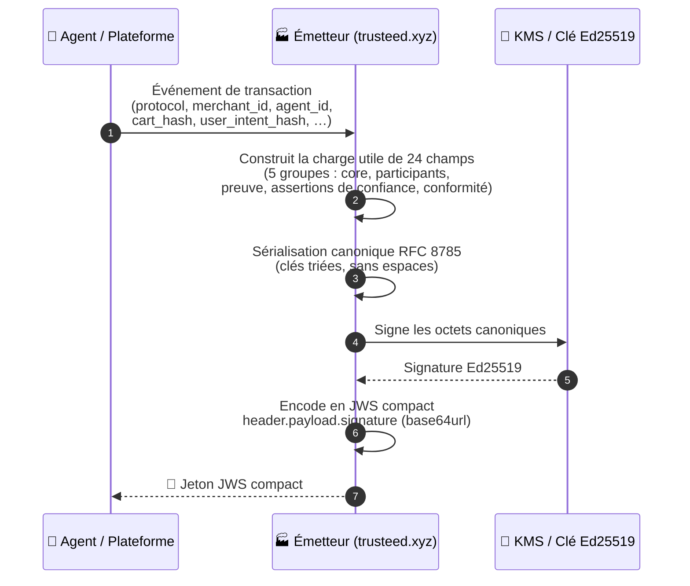
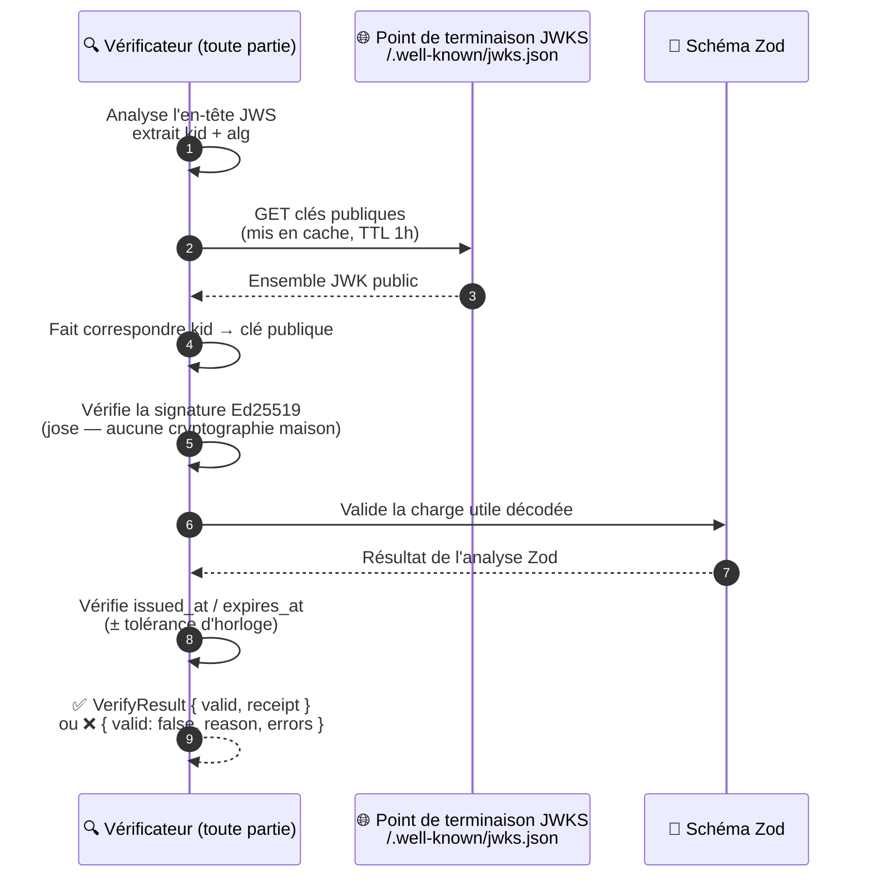
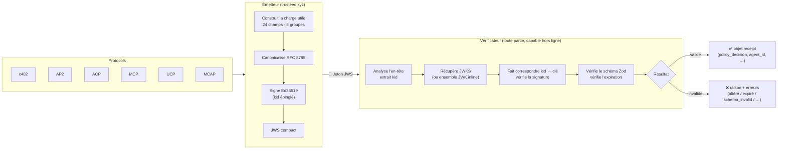

<!-- generated-by: gsd-doc-writer -->

[English](README.md) | [Español](README.es.md) | **Français** | [Deutsch](README.de.md)

# TrustReceipt

**Couche de preuve côté marchand pour le commerce agentique : signée, portable, vérifiable hors ligne**

[](SPEC.md)
[](LICENSE)
[](https://www.npmjs.com/package/trust-receipt-verifier)
[](https://github.com/trust-receipt/spec)

---

## Ce que c'est

TrustReceipt est un format de reçu ouvert destiné aux marchands. Il consigne les preuves des transactions de commerce agentique sous une forme que n'importe qui peut vérifier hors ligne, à travers des protocoles tels que ACP, AP2, x402, MCP, UCP et MCAP. Il se place à côté de ces protocoles et ne les concurrence pas. Les mandats AP2, les sessions de paiement ACP, les signatures Visa TAP et les règlements x402 restent tels quels, et TrustReceipt ajoute pour chacun un enregistrement cryptographique portable de la décision de politique appliquée.

Un TrustReceipt est une charge utile JSON signée sous forme de JWS, que vous pouvez vérifier hors ligne à l'aide d'un point de terminaison JWKS public. Chaque reçu consigne qui était l'agent, quel protocole s'est exécuté, quels fournisseurs de confiance se sont portés garants de la transaction, quelle politique s'est appliquée et à quelle décision elle a abouti. Tout cela tient dans un seul jeton autonome que n'importe quelle partie peut vérifier sans contacter l'émetteur.

Ce paquet est l'implémentation de référence du vérificateur et de l'émetteur. Il fait partie de la pile de contrôle marchand de Trusteed (instantanés de politique + points de contrôle des agents + reçus), mais le format de reçu lui-même est ouvert et portable d'un émetteur à l'autre.

---

## État des capacités

| Capacité                                                  | État                                 | Notes                                                                                  |
| ------------------------------------------------------------ | -------------------------------------- | ----------------------------------------------------------------------------------------- |
| Vérification JWS (Ed25519)                                | ✅ Implémenté                          | CLI + bibliothèque, aucune cryptographie maison (utilise `jose` v6)                        |
| Résolution de clé publique basée sur JWKS                 | ✅ Implémenté                          | Récupération mise en cache avec TTL ; un ensemble JWK inline est aussi pris en charge     |
| Schéma v1.0                                                | ✅ Stable                              | 10 vecteurs de conformité validés                                                          |
| Schéma v1.1 (champs alignés eIDAS)                        | 🟡 Code complet / expérimental          | 12 vecteurs supplémentaires validés ; l'ensemble de champs peut évoluer avant la v1.2      |
| JSON canonique RFC 8785                                    | ✅ Implémenté                          | Utilisé pour la signature + les hachages de la chaîne d'audit                             |
| Chaîne d'audit (`hash_chain_prev`)                        | ✅ Implémenté                          | Chaînage par marchand, toute altération est détectable                                     |
| Posture de cachet électronique avancé eIDAS                | 🟡 Candidat                             | Support au niveau champ ; **pas** un Cachet Électronique Qualifié (sans QTSP)              |
| Forme de preuve ESIGN / UETA                               | 🟡 Partiel                              | `esign_disclosure_hash` + contexte de consentement ; flux complet de divulgation en cours  |
| Preuve d'horodatage de confiance RFC 3161                  | 🟡 Optionnel / dépendant de l'intégration | Point d'ancrage présent via `trust-receipt-tsa-client` ; dépend du fournisseur TSA         |
| Signature côté émetteur avec AWS KMS                       | 🟡 Optionnel / côté émetteur            | Fourni par le paquet frère `trust-receipt-kms-signer` ; non requis pour la vérification    |
| Ports de référence (TS) / portages vers d'autres langages (Python, Go, Java) | 🟡 TS uniquement à ce jour | Les portages sont les bienvenus, voir `CONTRIBUTING.md`                                   |
| Export/vérification du proof-bundle AIVS (`aivs-export.ts`) | 🟡 Code complet                        | Projette un reçu v1.0 signé dans un bundle compatible AIVS `{ manifest_hash, session_sig, audit_log }` . Vérifiable hors ligne sans code Trusteed (spec-062 US1 : alignement, pas de séquestre) |
| Vérification d'artefact d'extension (`verify-extension-artifact.ts`) | 🟡 Code complet              | Vérifie les reçus d'effacement signés par le développeur et les manifestes d'extension du Trusteed Extension Marketplace |
| Forme compacte v1.0-legacy du reçu (`verifier.ts`)         | ✅ Implémenté                          | `verifyTrustReceipt` accepte également la charge utile compacte de style JWT émise par l'émetteur de la plateforme depuis spec-040. Exposée via `result.variant` / `result.legacyReceipt` |

> ✅ = implémentation de qualité production. 🟡 = présent et testé mais sujet à changement avant la GA de la v1.2, ou dépendant de l'intégration côté opérateur.

---

## Comment ça marche

Deux opérations indépendantes traitent un TrustReceipt : l'émission et la vérification. Elles peuvent s'exécuter sur des systèmes différents, à des moments différents, et ni l'une ni l'autre n'a besoin d'un secret partagé.

### Émission d'un reçu



### Vérification d'un reçu



### Vue d'ensemble



**Propriétés clés :**

- La vérification fonctionne hors ligne. Elle n'a besoin que de l'URL du JWKS (mise en cache publiquement) et n'appelle jamais l'émetteur
- Un seul format de reçu couvre x402, AP2, ACP, MCP, UCP et MCAP via `protocol_artifacts`
- `hash_chain_prev` relie les reçus en une chaîne propre à chaque marchand, dont toute altération est détectable (RFC 8785)
- `legal_posture` suit la posture de conformité eIDAS, ESIGN et UK-DIATF de chaque reçu

---

## Avertissement juridique

> Cachet vérifiable pour le commerce agentique. Chaque TrustReceipt génère une preuve cryptographique portable d'origine, d'intégrité, de consentement, d'autorisation de l'agent et de rétention auditable.
> Conçu pour être aligné sur ESIGN/UETA aux États-Unis et sur eIDAS dans l'UE en tant que preuve candidate de cachet électronique avancé, et compatible avec le cadre britannique des Signatures Électroniques et Services de Confiance (UK Electronic Signatures and Trust Services).
> Les cachets/signatures qualifiés nécessitent une émission ou une validation par un QTSP applicable.

> **Avertissement** : TrustReceipt est une preuve technique vérifiable cryptographiquement. Elle ne détermine pas en elle-même la responsabilité juridique. Le fait qu'un reçu donné soit admissible ou persuasif dans une juridiction ou une procédure spécifique dépend du droit local applicable, des accords entre les parties consentantes, et d'autres faits hors du champ de ce format d'enregistrement.

_La politique complète de déclarations est la TrustReceipt Claims Policy (`docs/legal/trust-receipt-claims-policy.md` dans le monorepo Trusteed). Elle ne fait pas partie de ce dépôt._

### État de compatibilité réglementaire

| Cadre réglementaire                            | Juridiction  | État                                                                                                                                                                                                                          | Champs v1.1                                                                                                  |
| ------------------------------------------------ | ------------ | ---------------------------------------------------------------------------------------------------------------------------------------------------------------------------------------------------------------------------- | -------------------------------------------------------------------------------------------------------------- |
| **eIDAS** (Règlement 910/2014)                  | UE           | 🟡 Candidat. `legal_posture` progresse `ades_candidate_no_tsa` → `ades_candidate_timestamped` → `ades_candidate_kms`. Le cachet qualifié (QeSeal) nécessite un QTSP.                                                       | `legal_posture`, `legal_posture_warnings`, `timestamp_evidence`, `esign_disclosure_hash`                     |
| **ESIGN / UETA**                                | États-Unis   | 🟡 Partiel. Cachet vérifiable avec preuve de consentement, attribution de l'agent, divulgation versionnée et rétention auditable, conçu pour prendre en charge ESIGN/UETA. Le flux complet de divulgation (URI de retrait, épinglage de version) est en cours. | `esign_disclosure_hash`, `consent_context.consent_disclosure_version`, `consent_context.withdrawal_uri_hash` |
| **Electronic Communications Act 2000 / DIATF**  | Royaume-Uni  | 🟡 Compatible au niveau schéma. La rétention sensible à la juridiction (Royaume-Uni : 7 ans par défaut) et le champ `legal_posture` transportent la preuve des services de confiance britanniques. L'alignement DIATF est vérifié au niveau schéma. La certification opérationnelle est en attente. | `legal_posture`, `privacy_classification.jurisdiction`, `export_bundle.retention_policy`                     |

> ⚠️ Rien de ce qui précède ne constitue un conseil juridique. Le statut de qualification réglementaire peut évoluer avec l'implémentation. Consultez un conseil juridique qualifié pour les exigences spécifiques à chaque juridiction.

---

## Vérification rapide

```bash
npm install trust-receipt-verifier
```

**Reçu v1.0 (JWS compact) :**

```typescript
import { verifyTrustReceipt } from "trust-receipt-verifier";

const result = await verifyTrustReceipt(jwsToken, {
  jwksUrl: "https://trusteed.xyz/.well-known/jwks.json",
});

if (result.valid) {
  console.log(result.receipt.policy_decision); // "allow"
} else {
  console.error(result.reason, result.errors);
}
```

**Enveloppe v1.1 (`receipt` + `envelope_metadata` + sidecars optionnels) :**

```typescript
import { verifyReceiptEnvelope } from "trust-receipt-verifier";
import type { VerifyOptions } from "trust-receipt-verifier";

const opts: VerifyOptions = {
  jwksHistory: {
    jws_compact: "<SignedJwksHistory JWS>",
    signed_by_root_sha256: "<issuer-root-sha256>",
  },
  trustAnchorPemSha256: "dd43bf2cd65023d79e41358226ed1197fcea36bc693f1c0fadde0e318bfd76a1",
  policyOidAllowlist: ["1.2.3.4.5.6.7.8.9"],
  // toleranceSeconds: 30,  // tolérance de dérive d'horloge par défaut (secondes)
  // mode: "strict",        // par défaut "compat" — voir "Mode strict vs compat" ci-dessous
  // allowStagingRoots: true, // staging/CI uniquement — ne jamais l'activer en production
};

const result = await verifyReceiptEnvelope(envelope, opts);

if (result.outcome === "accepted") {
  console.log(result.recomputedLegalPosture); // "ades_candidate_timestamped"
  if (result.warnings.includes("unknown_trust_provider_present")) {
    // l'enveloppe référence un fournisseur de confiance non encore reconnu par cette version du vérificateur
  }
} else {
  console.error(result.errorCode, result.detail);
  // errorCode peut être : "receipt_expired" | "receipt_not_yet_valid" |
  // "jwks_history_signature_invalid" | "unknown_kid" | "schema_invalid" | …
}
```

> **`allowStagingRoots`** : la valeur par défaut est `false`. Lorsqu'elle est `false` (par défaut en production), tout `jwksHistory.signed_by_root_sha256` absent de la liste d'ancres de confiance embarquée provoque un rejet immédiat (`jwks_history_signature_invalid`). À définir sur `true` uniquement dans les environnements de staging ou CI utilisant des bundles d'historique JWKS non signés/factices.

---

## Anatomie du reçu

Une charge utile TrustReceipt contient 24 champs répartis en cinq groupes :

**Core**

| Champ             | Type          | Description                     |
| ----------------- | ------------- | -------------------------------- |
| `receipt_id`     | UUID v4        | Identifiant unique du reçu       |
| `schema_version` | `"1.0"`        | Littéral de version du schéma    |
| `issued_at`      | Secondes Unix  | Date de création du reçu         |
| `expires_at`     | Secondes Unix  | Date d'expiration du reçu        |
| `issuer`         | string         | Domaine de la plateforme émettrice |

**Participants**

| Champ             | Type   | Description                                          |
| ----------------- | ------ | ------------------------------------------------------ |
| `merchant_id`    | string | Identifiant du marchand                                 |
| `agent_id`       | string | Identifiant de session ou d'instance de l'agent         |
| `agent_provider` | string | Fournisseur d'IA (`anthropic`, `openai`, `google`, …)  |

**Preuve de Transaction**

| Champ                 | Type               | Description                                                                                |
| --------------------- | ------------------ | ---------------------------------------------------------------------------------------------- |
| `user_intent_hash`   | string (non vide)  | Hachage de l'intention originale de l'utilisateur. Doit être non vide (SHA-256 hex recommandé)  |
| `cart_hash`          | SHA-256 hex        | Hachage du contenu du panier au moment de la décision (optionnel)                                |
| `order_hash`         | SHA-256 hex        | Hachage de l'objet de commande réglée (optionnel)                                                |
| `transaction_id`     | string             | Référence de transaction de la plateforme (optionnel)                                            |
| `protocol`           | enum               | `x402 \| AP2 \| ACP \| MCP \| UCP \| MCAP`                                                        |
| `protocol_artifacts` | array              | Hachages d'objets de preuve spécifiques au protocole                                             |
| `payment_reference`  | object             | Nom du PSP + référence, sans données de paiement brutes (optionnel)                              |

**Assertions de Confiance**

| Champ                       | Type  | Description                                                    |
| ----------------------------- | ----- | ------------------------------------------------------------------ |
| `risk_signals`              | array | Signaux normalisés provenant de l'émetteur ou des fournisseurs      |
| `trust_provider_assertions` | array | Assertions notées provenant de ClearSale, Trulioo, Mastercard, etc. |
| `policy_decision`           | enum  | `allow \| deny \| review \| challenge`                              |

**Conformité**

| Champ                     | Type        | Description                                                          |
| --------------------------- | ----------- | ------------------------------------------------------------------------ |
| `liability_context`      | object      | Assertant et portée (optionnel)                                          |
| `consent_context`        | object      | Hachage de consentement, portée, horodatage (optionnel)                  |
| `privacy_classification` | object      | Indicateur PII, jours de rétention, juridiction (optionnel)              |
| `verification_methods`   | array       | URL JWKS ou DID pour la résolution de clé. Au moins une entrée requise   |
| `kid`                    | string      | ID de clé utilisé pour signer ce reçu                                    |
| `hash_chain_prev`        | SHA-256 hex | Reçu précédent dans la chaîne d'audit (optionnel)                        |
| `attachments`            | array       | Références de fichiers nommées et hachées (optionnel)                    |

---

## Support des protocoles

| Protocole                                                                                                  | Mappage d'artefacts | Types d'artefacts principaux                               |
| -------------------------------------------------------------------------------------------------------------- | ---------------------- | -------------------------------------------------------------- |
| [MCAP](https://developer.mastercard.com/mastercard-checkout-solutions/documentation/use-cases/agent-pay/) | Défini                 | `mcap_consent_hash`, `mcap_nonce`                               |
| [x402](https://github.com/x402-foundation/x402)                                                           | Défini                 | `permit2_hash`, `settlement_hash`, `upto_envelope_hash`         |
| [AP2](https://github.com/google-agentic-commerce/AP2)                                                     | Défini                 | `mandate_hash`, `ap2_consent_hash`                              |
| [MCP](https://modelcontextprotocol.io)                                                                    | Défini                 | `mcp_call_hash`, `tool_call_hash`                               |
| [ACP](https://github.com/agentic-commerce-protocol/agentic-commerce-protocol)                             | Défini                 | `acp_session_hash`, `acp_policy_hash`                           |
| [UCP](https://github.com/Universal-Commerce-Protocol/ucp)                                                 | Défini                 | `ucp_token_hash`                                                |

---

## Conformité

Une implémentation de vérificateur doit passer les 10 vecteurs de test (v1.0) pour revendiquer la conformité TrustReceipt. Trois niveaux sont définis :

> **État v1.1 (2026-05-06).** Le durcissement eIDAS ajoute 12 vecteurs v1.1 sous `test-vectors/v11/`. Le schéma v1.1 supprime les champs legacy `mandate_hash` / `permit2` / `mcp` de rail et introduit `payment_authorization_hash`, `authorization_scheme`, `legal_posture_warnings`, et `esign_disclosure_hash`. Suite combinée 58/58 validée.

| Niveau | Nom       | Exigence                                                                        |
| -------- | --------- | ------------------------------------------------------------------------------------ |
| 1        | Verifier  | Passe les 10 vecteurs de test                                                         |
| 2        | Issuer    | Niveau 1 + émet correctement des reçus valides                                        |
| 3        | Provider  | Niveau 2 + co-auteur d'au moins un type de `trust_provider_assertions` avec de vraies données |

Cette implémentation de référence est conforme au Niveau 2. Il existe deux façons d'exécuter la suite de conformité :

**(a) Tests unitaires.** Vérifie les 10 vecteurs à l'aide de l'infrastructure de test préconstruite (10 tests) :

```bash
pnpm test
```

**(b) Conformité JWS de bout en bout.** Génère une nouvelle paire de clés, signe les 10 vecteurs, appelle `verifyTrustReceipt` et indique pour chaque vecteur s'il réussit ou échoue :

```bash
# Via la CLI (nécessite que le paquet soit d'abord compilé)
trust-receipt conformance

# Ou directement avec tsx (aucune compilation requise)
npx tsx scripts/validate-vectors.ts
```

Ajoutez le badge à votre projet une fois que les 10 vecteurs sont validés :

```markdown
[](https://github.com/trust-receipt/spec)
```

---

## Structure du dépôt

```
trust-receipt-verifier/
├── SPEC.md                            — spécification formelle (faisant autorité)
├── CONTRIBUTING.md                    — comment contribuer des vecteurs, portages et schémas de fournisseur
├── LICENSE                            — MIT
├── src/
│   ├── index.ts                       — exports du paquet
│   ├── verifier.ts                    — verifyTrustReceipt() + parseTrustReceiptUnsafe() (v1.0, y compris la forme legacy-compact)
│   ├── verify-1.0.ts                  — internes du vérificateur v1.0
│   ├── verify-1.1.ts                  — verifyReceiptEnvelope() (enveloppe v1.1 eIDAS) + prédicats typés de fournisseur de confiance
│   ├── zod-1.1.ts                     — schéma Zod v1.1 (racine stricte — rejette les clés de premier niveau inconnues)
│   ├── types-1.1.ts                   — formes typées d'assertion de fournisseur de confiance
│   ├── issuer.ts                       — issueTrustReceipt()
│   ├── embedded-issuer-root.ts        — ancre de confiance à la compilation + validateChain()
│   ├── verify-jwks-history.ts         — vérification de la chaîne d'historique JWKS
│   ├── verify-timestamp-evidence.ts   — vérification de l'horodatage RFC 3161
│   ├── verify-export-bundle.ts        — vérification de bundle d'export hors ligne
│   ├── verify-extension-artifact.ts   — vérification de reçu d'effacement / manifeste d'extension (Extension Marketplace)
│   ├── aivs-export.ts                 — export/vérification du proof-bundle AIVS (spec-062 US1)
│   ├── __tests__/                     — tests unitaires + de conformité
│   └── schema/
│       ├── trust-receipt.schema.ts        — schéma Zod (source de vérité pour les types TypeScript v1.0)
│       └── trust-receipt-legacy.schema.ts — forme compacte v1.0-legacy (émise par la plateforme depuis spec-040)
├── test-vectors/
│   ├── README.md                    — comment utiliser les vecteurs
│   ├── vectors.json                 — manifeste des vecteurs avec résultats attendus
│   ├── valid/                       — TC-001 à TC-005
│   ├── invalid/                     — TC-006 à TC-010
│   └── v11/, v11-strict/            — vecteurs de conformité v1.1 + mode strict
├── bin/
│   └── trust-receipt.ts (source) → dist/bin/trust-receipt.js (compilé) — CLI : verify, inspect, generate-key, conformance
└── demo/                            — scripts de démonstration exécutables
```

---

## Émettre un reçu

```typescript
import { issueTrustReceipt } from "trust-receipt-verifier";

const jws = await issueTrustReceipt({
  payload: {
    issuer: "trusteed.xyz",
    merchant_id: "merchant-001",
    agent_id: "agent-session-xyz",
    agent_provider: "anthropic",
    user_intent_hash: "<sha256-hex-of-user-intent>",
    protocol: "MCP",
    protocol_artifacts: [{ type: "mcp_call_hash", hash: "<sha256-hex>" }],
    policy_decision: "allow",
    verification_methods: [
      { type: "jwks", value: "https://trusteed.xyz/.well-known/jwks.json" },
    ],
    kid: "tr-ed25519-2026-04-29",
  },
  privateKeyJwk: myEd25519PrivateKey,
  kid: "tr-ed25519-2026-04-29",
});
```

> **Canonicalisation** : la charge utile est sérialisée avec RFC 8785 (clés triées, sans espaces) avant la signature, si bien que `SHA-256(payload)` est identique dans toute implémentation conforme.

## Vérificateurs d'artefacts associés

**Export du proof-bundle AIVS.** Projette un reçu v1.0 signé dans un bundle compatible AIVS (`draft-stone-aivs-00`). Vous pouvez le vérifier hors ligne avec le seul JWS et le JWKS de l'émetteur :

```typescript
import { exportAivsProofBundle, verifyAivsProofBundle } from "trust-receipt-verifier";

const bundle = exportAivsProofBundle(receiptJws); // { manifest_hash, session_sig, kid, alg, audit_log }
const result = await verifyAivsProofBundle(bundle, { jwks: issuerJwks });
```

**Artefacts du Extension Marketplace.** Vérifiez les reçus d'effacement signés par le développeur (preuve de destruction des données après la désinstallation) ou les manifestes d'extension :

```typescript
import { verifyExtensionArtifact } from "trust-receipt-verifier";

const result = await verifyExtensionArtifact(jws, {
  kind: "erasure", // ou "manifest" — l'appelant indique de quel artefact il s'agit
  jwksUrl: "https://trusteed.xyz/.well-known/jwks.json",
});
// result.valid: boolean; result.reason en cas d'échec ("malformed_jws" | "unsupported_alg" | "missing_kid" | "jwks_unreachable" | "kid_not_found" | "signature_invalid" | "payload_not_json" | "shape_invalid")
```

## CLI

```bash
# Génère une paire de clés Ed25519
trust-receipt generate-key

# Vérifie un reçu v1.0 (JWS compact)
trust-receipt verify receipt.jws --jwks-url https://trusteed.xyz/.well-known/jwks.json

# Vérifie une enveloppe v1.1 (objet JSON avec `receipt` + `envelope_metadata`)
trust-receipt verify envelope.json \
  --type receipt-v11 \
  --jwks-history-file issuer-jwks-history.json \
  --trust-anchor-sha256 dd43bf2cd65023d79e41358226ed1197fcea36bc693f1c0fadde0e318bfd76a1 \
  --policy-oid 1.2.3.4.5.6.7.8.9

# Vérifie une enveloppe v1.1 en mode STRICT (application sémantique de l'ancre de confiance)
trust-receipt verify envelope.json \
  --type receipt-v11 \
  --jwks-history-file issuer-jwks-history.json \
  --trust-anchor-sha256 dd43bf2cd65023d79e41358226ed1197fcea36bc693f1c0fadde0e318bfd76a1 \
  --strict

# Staging / CI uniquement — ignore la vérification de l'ancre racine (ne jamais utiliser en production)
trust-receipt verify envelope.json --type receipt-v11 \
  --jwks-history-file issuer-jwks-history.json \
  --trust-anchor-sha256 <sha256> \
  --allow-staging-roots

# Inspecte un reçu sans vérifier la signature
trust-receipt inspect receipt.jws

# Exécute la suite de conformité complète de bout en bout (signe + vérifie les 10 vecteurs)
trust-receipt conformance
```

> **Autodétection de `--type`** : lorsque `--type` est omis, la CLI inspecte la forme de l'entrée. Un objet JSON possédant à la fois les clés `receipt` et `envelope_metadata` est traité automatiquement comme `receipt-v11`. Une chaîne compacte `header.payload.sig` est traitée comme `receipt` (v1.0). `--type` accepte aussi `erasure`, `manifest` et `jwks-history` pour les vérificateurs d'artefacts décrits ci-dessus. Précisez-le explicitement lorsque l'autodétection est ambiguë (les charges utiles erasure et manifest sont toutes deux des JWS compacts sans clés `receipt`/`envelope_metadata`).

---

## Mode de vérification strict vs compat (v1.1)

Au niveau du schéma, le vérificateur v1.1 contrôle `verification_methods.trust_anchor_sha256`
et `verification_methods.jwks_sha256` uniquement par leur format regex (64 caractères hex).
Ce contrôle laisse passer une ancre factice opaque, c'est-à-dire une valeur entièrement à
zéro ou d'un seul nibble. L'ancre factice est bien formée mais n'a aucune véritable liaison
à la chaîne de confiance, et les émetteurs émettent de telles ancres avant une cérémonie
d'ancre de production. L'option `mode` (bibliothèque) et le flag `--strict` (CLI) ajoutent
une couche sémantique :

| Condition                                                              | `compat` (par défaut, canary)          | `strict`                                     |
| -------------------------------------------------------------------------- | ----------------------------------------- | ------------------------------------------------ |
| `trust_anchor_sha256` est une ancre factice opaque (tout à zéro / un seul nibble) | avertit `trust_anchor_sha256_stub`         | rejette `trust_anchor_stub_rejected`             |
| `jwks_sha256` est une ancre factice opaque                                | avertit `jwks_sha256_stub`                 | rejette `jwks_sha256_stub_rejected`              |
| `trust_anchor_sha256` ≠ `trustAnchorPemSha256` épinglé par l'opérateur    | avertit `trust_anchor_sha256_mismatch`     | rejette `trust_anchor_mismatch`                  |
| reçu buyer_agent sans liaison d'identité d'agent                          | avertit `agent_identity_absent`            | rejette `agent_identity_required_strict`         |
| horodatage RFC 3161 / LOTL dégradé (p. ex. TSA indisponible)              | avertit (`tsa_unavailable`)                | avertit (`tsa_unavailable`), accepté dans les deux modes |

`compat` est la valeur par défaut pour que le déploiement ne casse rien pendant que les
données d'observabilité s'accumulent. Passez à `strict` une fois que les émetteurs ont
terminé la cérémonie d'ancre de production. Les quatre vecteurs de conformité négatifs
nommés se trouvent dans `test-vectors/v11-strict/` et sont régénérés par
`scripts/generate-strict-mode-vectors.ts`.

```ts
// Utilisation en bibliothèque
import { verifyReceiptEnvelope } from "trust-receipt-verifier";

const result = await verifyReceiptEnvelope(envelope, {
  jwksHistory,
  trustAnchorPemSha256: "<64-hex-pinned-anchor>",
  policyOidAllowlist: ["1.2.3.4.5.6.7.8.9"],
  mode: "strict", // la valeur par défaut est "compat"
});
```

---

## Documentation

| Document                                     | Description                                                                                              |
| ----------------------------------------------- | -------------------------------------------------------------------------------------------------------------- |
| [SPEC.md](SPEC.md)                            | Spécification formelle : format wire, référence des champs, règles de conformité                                 |
| [docs/architecture.md](docs/architecture.md)  | Architecture interne : enveloppe de signature, résolution de clé, pipeline de vérification, propriétés de sécurité  |
| [CONTRIBUTING.md](CONTRIBUTING.md)            | Comment ajouter des vecteurs de conformité, des portages vers d'autres langages, ou des schémas de fournisseur de confiance |
| [CHANGELOG.md](CHANGELOG.md)                  | Historique des versions et changements incompatibles                                                             |

---

## Contribuer

Voir [CONTRIBUTING.md](CONTRIBUTING.md) pour savoir comment ajouter des vecteurs de conformité, porter le vérificateur vers un autre langage, ou co-rédiger un schéma `trust_provider_assertions` en tant que partenaire fournisseur de confiance.

---

## Ce qu'un TrustReceipt ne prouve PAS

Un reçu est une preuve technique, pas une preuve juridique ni une garantie opérationnelle. Il n'affirme délibérément **pas** :

- **Que le paiement a été capturé ou réglé.** Un reçu avec `policy_decision: "allow"` enregistre la décision et l'intention. Le règlement est enregistré par le PSP / rail sous-jacent (débit Stripe, transaction on-chain x402, complétion ACP, etc.) et référencé via `payment_reference` ou `protocol_artifacts`, pas par le reçu lui-même.
- **Que les biens ou services ont été livrés.** La preuve d'exécution vit dans le système de commandes du marchand.
- **La conformité KYC / KYA.** Un reçu enregistre qu'un fournisseur de confiance a affirmé un niveau (p. ex. `kya_status`) au moment de l'émission. Ce n'est pas un substitut à une vérification KYC/KYA indépendante.
- **Le statut de Cachet Électronique Qualifié eIDAS.** Même avec `legal_posture` renseigné, un TrustReceipt est au mieux un candidat de Cachet Électronique **Avancé**. Les cachets qualifiés nécessitent une émission par un QTSP répertorié dans l'UE, ce qui est hors du champ de ce paquet.
- **La responsabilité juridique ou l'admissibilité.** Un reçu est une preuve cryptographique. Son admissibilité ou son caractère persuasif dans une juridiction spécifique dépend du droit local, des accords des parties, et de faits hors du champ du format du reçu.
- **Que l'utilisateur voulait réellement ce que l'agent a fait.** Le reçu enregistre `user_intent_hash`, ce qui montre qu'un texte d'intention existait et a été haché. Il ne montre pas que le hachage correspond à une expression humaine vérifiée.

Si votre cas d'usage exige l'une des garanties ci-dessus, utilisez le reçu comme primitif d'audit à côté de ces mécanismes. Il ne les remplace pas.

---

## Modèle de menaces

Le vérificateur est conçu pour détecter les classes de falsification suivantes. Pour chacune, le vérificateur renvoie un `{ valid: false, reason }` structuré plutôt que de lever une exception.

| Menace                                    | Défense                                                                                                                        | Comportement du vérificateur (v1.0 / v1.1)                                                     |
| -------------------------------------------- | ------------------------------------------------------------------------------------------------------------------------------------ | ------------------------------------------------------------------------------------------------------ |
| Falsification de signature / altération de charge utile | Ed25519 sur les octets canoniques RFC 8785 ; `kid` épinglé dans l'en-tête et la charge utile                                          | `"signature_invalid"` / `"signature_invalid"`                                                          |
| Mauvaise clé utilisée pour signer          | Incohérence de `kid` entre l'en-tête JWS et l'entrée JWKS                                                                              | `"kid_not_found"` / `"unknown_kid"`                                                                     |
| Reçu expiré                                | `expires_at` vérifié par rapport à l'horloge du vérificateur avec tolérance configurable (par défaut ±30 s)                          | `"expired"` / `"receipt_expired"`                                                                        |
| Reçu émis dans le futur                    | `issued_at` vérifié par rapport à l'horloge du vérificateur avec la même tolérance                                                    | `"not_yet_valid"` / `"receipt_not_yet_valid"`                                                           |
| Rétrogradation de schéma / champs inconnus | Validation de schéma Zod stricte sur les champs connus ; clés de premier niveau inconnues rejetées                                   | `"schema_invalid"` / `"schema_invalid"`                                                                 |
| Historique JWKS falsifié / non signé       | `jwksHistory.signed_by_root_sha256` doit correspondre à une ancre de confiance embarquée ; échec dur si inconnu sauf `allowStagingRoots` | n/a (v1.0) / `"jwks_history_signature_invalid"`                                                          |
| Assertion de fournisseur de confiance inconnu | Le vérificateur avertit mais ne rejette pas, préservant la compatibilité ascendante                                                   | n/a (v1.0) / avertissement `"unknown_trust_provider_present"`                                             |
| Rejeu d'un ancien reçu                     | **Hors du champ du vérificateur seul.** Les consommateurs doivent imposer l'unicité via `receipt_id` + `issued_at` + règles métier    | n/a. Le vérificateur renvoie `valid: true` / `outcome: "accepted"` pour les rejeux non encore expirés  |
| Rotation JWKS pendant qu'un reçu est actif | La récupération JWKS se rafraîchit sur un manque de `kid` ; les anciennes clés peuvent être conservées dans l'ensemble JWKS pendant la fenêtre de grâce de rotation | Vérifie tant que le `kid` reste publié                                                                   |
| Clé d'émetteur compromise                  | La révocation de clé est à la charge de l'opérateur : retirer le `kid` de l'ensemble JWKS ; les vérificateurs échoueront en mode fermé | `"kid_not_found"` / `"unknown_kid"` une fois retirée                                                     |
| Dérive d'horloge entre émetteur/vérificateur | Option `toleranceSeconds` (par défaut 30 s)                                                                                          | Dans la tolérance : passe. En dehors : `"expired"` / `"receipt_expired"` ou `"receipt_not_yet_valid"`  |
| MITM sur le point de terminaison JWKS      | Le TLS vers l'hôte JWKS est de la responsabilité de l'opérateur ; épingler l'URL JWKS hors bande protège contre une substitution malveillante | n/a. Le vérificateur fait confiance à l'URL configurée                                                   |

**Non-objectifs.** Le vérificateur **ne** valide **pas** : (a) si le paiement sous-jacent a été réglé, (b) si la politique du marchand était correctement configurée, (c) l'admissibilité juridictionnelle, (d) les listes de révocation externes au point de terminaison JWKS, ou (e) la preuve spécifique au protocole à l'intérieur de `protocol_artifacts` (celles-ci sont validées par l'appelant par rapport à la spécification du protocole concerné).

---

## Politique de versionnage

Ce paquet suit le **Versionnage Sémantique** en ce qui concerne l'API publique _et_ le format wire du reçu.

| Type de changement                                       | Bump   | Compatibilité                                                                                                |
| ------------------------------------------------------------ | ------ | ------------------------------------------------------------------------------------------------------------------ |
| Ajout d'un champ optionnel à la charge utile                 | mineur | Les anciens vérificateurs ignorent les champs inconnus **seulement si** le champ est espacé de noms ou explicitement marqué optionnel |
| Ajout d'un champ obligatoire à la charge utile                | majeur | Les anciens vérificateurs rejetteront. Un basculement coordonné est requis                                         |
| Suppression ou renommage d'un champ de la charge utile        | majeur | Changement incompatible. Les émetteurs doivent continuer à émettre des reçus v1.x jusqu'à ce que les vérificateurs se soient mis à jour |
| Ajout d'une nouvelle valeur d'énumération `protocol`          | mineur | Les anciens vérificateurs rejetteront les valeurs d'énumération inconnues. N'émettez la nouvelle valeur qu'une fois qu'elle est prise en charge par les vérificateurs |
| Durcissement d'une contrainte Zod (p. ex. format, longueur)   | mineur | Rétrocompatible au moment de l'analyse. La nouvelle contrainte ne vaut que pour l'avenir                           |
| Changement d'API de la bibliothèque du vérificateur (signature de fonction) | majeur | Le code appelant doit être mis à jour                                                                              |
| Changement d'API de la bibliothèque du vérificateur (nouvel argument optionnel) | mineur | Les appelants existants ne sont pas affectés                                                                       |

**Vérification entre versions.** Le vérificateur v1.1.x vérifie les reçus émis sous le schéma v1.0 _et_ le schéma v1.1. Les reçus v1.0 n'auront simplement pas les champs v1.1 (`legal_posture`, `consent_context`, etc.) et le vérificateur les traite comme optionnels. Il n'est pas prévu d'abandonner la vérification v1.0 dans une version v1.x. L'abandonner exige un bump majeur vers v2.0 et une fenêtre de dépréciation d'au moins 12 mois.

**Champ `schema_version`.** Les reçus portent `schema_version: "1.0"` ou `schema_version: "1.1"`. Le vérificateur aiguille la validation de schéma sur ce champ. Les reçus sans `schema_version` sont rejetés (`reason: "schema_invalid"`).

---

## Remerciements

TrustReceipt est un format de preuve inter-protocoles. Les parties externes suivantes définissent des schémas, protocoles, ou infrastructures auxquels les reçus TrustReceipt peuvent faire référence ou attester. Aucune de ces organisations n'est un collaborateur formel de ce dépôt. Ces relations sont des intégrations d'interopérabilité. Ce ne sont pas des approbations.

### Auteurs de protocole (définissent les champs du schéma)

| Protocole | Auteur | Champ de schéma TrustReceipt |
| ----------- | ------ | ------------------------------- |
| [ACP (Agentic Commerce Protocol)](https://github.com/agentcommerceprotocol/acp) | [OpenAI](https://openai.com) + [Stripe](https://stripe.com) | `authorization_scheme: "acp_session_token"`, `protocol: "ACP"` |
| [AP2 (Agent Payment Protocol v2)](https://developers.google.com/wallet) | [Google](https://google.com) | `authorization_scheme: "ap2_mandate_jws"`, `protocol: "AP2"`, `ap2_consent_hash` |
| [x402 (paiement en stablecoin)](https://github.com/x402-foundation/x402) | [Coinbase](https://coinbase.com) + [Cloudflare](https://cloudflare.com) | `authorization_scheme: "evm_permit2" / "svm_token_authorization" / "x402_native"`, `protocol: "x402"` |
| [MCAP (Mastercard Agent Pay)](https://developer.mastercard.com/product/agent-pay/) | [Mastercard](https://mastercard.com) | `authorization_scheme: "mcap_cart_binding"`, `protocol: "MCAP"`, `mcap_consent_hash` |
| [MCP (Model Context Protocol)](https://github.com/modelcontextprotocol/specification) | [Anthropic](https://anthropic.com) | `authorization_scheme: "mcp_tool_invocation"`, `protocol: "MCP"` |
| [UCP (Universal Commerce Protocol)](https://github.com/Universal-Commerce-Protocol/ucp) | [Google](https://google.com) | `authorization_scheme: "ucp_rule_set_plus_agent_token"`, `protocol: "UCP"` |

### Fournisseurs actifs en runtime (câblés dans `trust_provider_assertions[]`)

Ces fournisseurs produisent des assertions structurées que la logique `recomputeLegalPosture` de `verify-1.1.ts` lit pour déterminer le `LegalPosture` faisant autorité du vérificateur. Utilisez les prédicats de type exportés (`isRfc9421ProviderAssertion`, `isHumanProviderAssertion`, `isVisaTapProviderAssertion`) pour affiner vers les formes typées définies dans `types-1.1.ts`.

| Fournisseur | Champ `provider` de l'assertion | Intégration |
| ------------- | ---------------------------------- | -------------- |
| [IETF RFC 9421](https://www.rfc-editor.org/rfc/rfc9421) (HTTP Message Signatures) | `"rfc9421-native"` | Vérifie les signatures de messages HTTP de tout agent disposant d'un point de terminaison JWKS public. L'émetteur l'intègre de manière optionnelle |
| [HUMAN Security — AgenticTrust](https://www.humansecurity.com/agentictrust) | `"human"` | Intégration optionnelle d'identité d'agent. Aucun SDK HUMAN n'est importé dans ce paquet vérificateur |
| [Visa TAP](https://developer.visa.com/) (Trusted Agent Protocol) | `"visa"` | Validé lorsque le domaine du signataire est `*.visa.com` ou `*.visa.net` avec le tag `"agent-browser-auth"` ou `"agent-payer-auth"` |

### Infrastructure côté émetteur (non utilisée par ce paquet vérificateur)

| Outil | Rôle |
| ------- | ----- |
| [freeTSA](https://freetsa.org/) | Autorité d'horodatage RFC 3161 par défaut de la Phase 1. L'URL est propre à chaque reçu (champ `tsa_endpoint`) et n'est pas codée en dur ici |
| [AWS KMS](https://aws.amazon.com/kms/) | Clés de signature Ed25519 de l'émetteur et CMK HMAC pour les hachages issus de PII ; géré par le paquet frère `trust-receipt-kms-signer` |

---

## Avis de marque déposée

TrustReceipt n'est affilié à, approuvé par, ni officiellement soutenu par Mastercard, Anthropic, Skyfire, Coinbase, HUMAN Security, Visa, ou toute autre entreprise ou propriétaire de protocole nommé référencé dans cette spécification. Les noms de protocole (AP2, MCAP, ACP, MCP, x402, UCP) sont utilisés de manière descriptive pour indiquer uniquement des cibles d'interopérabilité. Toutes les marques commerciales et marques déposées sont la propriété de leurs détenteurs respectifs.

---

## Licence

MIT, voir [LICENSE](LICENSE). Copyright MCPWebStore (trusteed.xyz), 2026.
