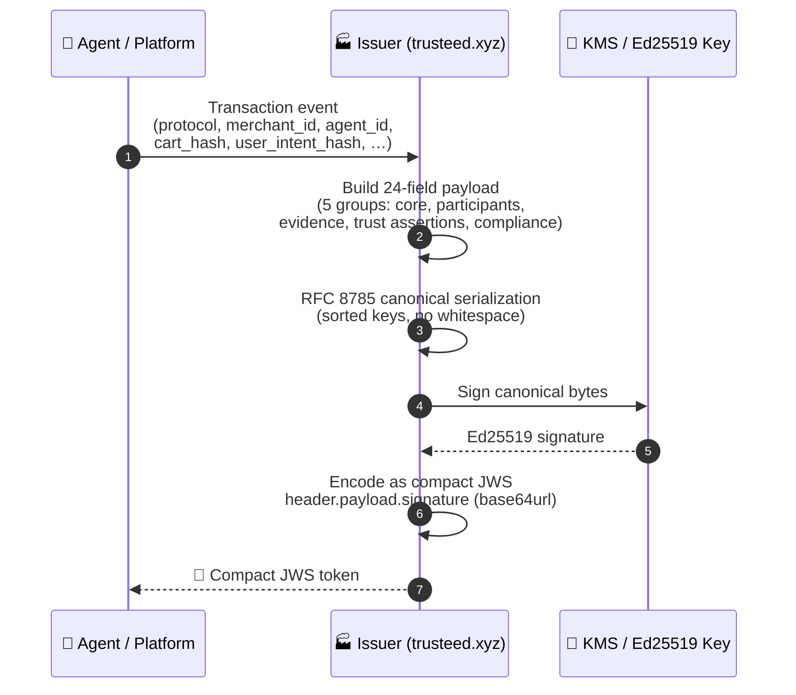
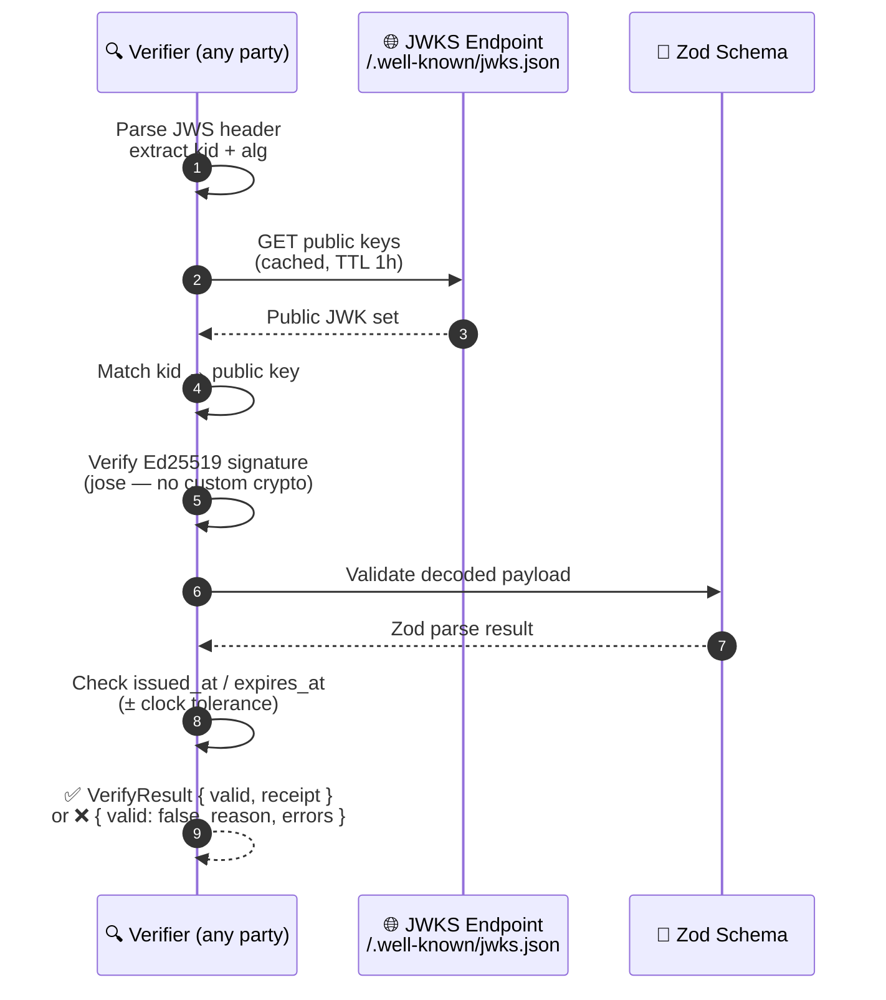
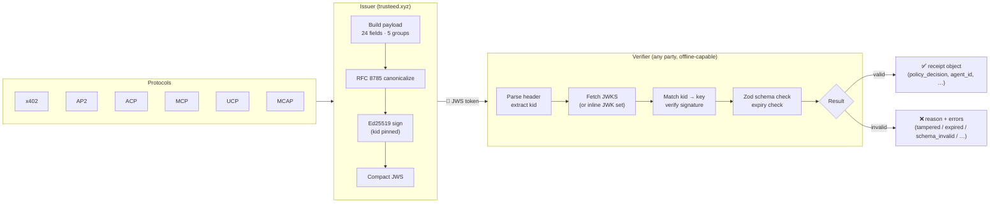

# TrustReceipt

**Cross-protocol evidence receipts for agentic commerce**

[](SPEC.md)
[](SPEC.md)
[](LICENSE)
[](https://www.npmjs.com/package/@agenticmcpstores/trust-receipt-verifier)
[](https://github.com/Trusteedxyz/Trust-Receipt-Verifier)
[](test-vectors/)

---

## What it is

TrustReceipt is an open standard for JWS-signed JSON receipts that are verifiable offline against a public JWKS endpoint. A receipt can represent evidence hashes from protocols such as x402, AP2, ACP, MCP, UCP, and MCAP without modification to the receipt format itself. Each receipt proves who the agent was, which protocol ran, what trust providers vouched for the transaction, and what policy decision was reached — all in a single self-contained token that any party can verify without calling back to the issuer.

**v1.1** (May 2026) adds eIDAS-aligned fields: `legal_posture`, RFC 3161 timestamp evidence, AWS KMS-backed signing, consent context with ESIGN/UETA fields, and jurisdiction-aware retention. The v1.0 format remains stable and production-active.

---

## How it works

A TrustReceipt flows through two independent operations — **issuing** and **verifying** — that can run in different systems at different times, with no shared secret required.

### Issuing a receipt



### Verifying a receipt



### Full picture



**Key properties:**
- **Offline-capable** — verification only needs the JWKS URL (publicly cached); no call back to the issuer
- **Protocol-agnostic** — one receipt format covers x402, AP2, ACP, MCP, UCP, and MCAP via `protocol_artifacts`
- **Audit-chainable** — `hash_chain_prev` links receipts in a tamper-evident per-merchant chain (RFC 8785)
- **Jurisdiction-aware** — `legal_posture` tracks eIDAS / ESIGN / UK-DIATF compliance posture per receipt

---

## Legal Disclaimer

> TrustReceipt generates portable cryptographic evidence of origin, integrity, consent, agent authorization, and auditable retention.
> Designed to be compatible with ESIGN/UETA in the US, with EU eIDAS Regulation 910/2014 as a candidate advanced electronic seal, and with the UK Electronic Communications Act 2000 and Digital Identity and Attributes Trust Framework (DIATF).
> Qualified Electronic Seals (QeSeal) require issuance or co-sealing by an accredited QTSP.

> **Disclaimer**: TrustReceipt is cryptographically verifiable technical evidence. It does not by itself determine legal liability. Whether a given receipt is admissible or persuasive in a specific jurisdiction depends on applicable local law, the consenting parties' agreements, and other facts beyond the scope of this record format.

> **Claims policy**: Do not describe TrustReceipt as "eIDAS certified", "qualified electronic seal", or "legal equivalent to a handwritten signature" in marketing materials. Correct terminology: "cryptographically verifiable evidence", "tamper-evident receipt", "advanced electronic seal candidate".

---

## Regulatory Compatibility Status

> Last updated: 2026-05-13 · Post spec-049 Phase 13 (134/134 tests passing)

| Framework | Jurisdiction | v1.0 (production) | v1.1 (code-complete) | Key v1.1 fields |
|---|---|---|---|---|
| **eIDAS** Art. 35 — Simple Seal | EU | ✅ Active | — | `kid`, `verification_methods` |
| **eIDAS** Art. 36 — Advanced Seal (AdES) | EU | ⚠️ Candidate (no KMS ARN yet) | ✅ Code-complete, not wired to hot path | `legal_posture`, `legal_posture_warnings`, `timestamp_evidence` |
| **eIDAS** Art. 40 — Qualified Seal (QES) | EU | ❌ Requires QTSP | ❌ Deferred (spec-050) | — |
| **EUDI Wallet** (EU 2024/1183) | EU | ❌ Blocked by legal | ❌ Analysis done, blockers unresolved | — |
| **ESIGN Act** (15 U.S.C. §§7001-7006) | US | ⚠️ ~70% — core seal present | ✅ ~85% — consent+disclosure fields | `esign_disclosure_hash`, `consent_context.consent_disclosure_version`, `consent_context.withdrawal_uri_hash` |
| **UETA** (47 states + DC) | US | ⚠️ Same as ESIGN | ✅ ~85% — same fields | Same as ESIGN |
| **ECA 2000 + SI 2002/318** | UK | ✅ Ed25519 seal admissible | ✅ Statute ref updated | `legal_posture`, `privacy_classification.jurisdiction` |
| **UK DIATF** v0.4/1.0 (OfDIA) | UK | ⚠️ Schema pass-through only | ⚠️ No GPG45/44 binding | `trust_provider_assertions[].provider="uk-diatf"`, `assurance_level` |

> ⚠️ None of the above constitutes legal advice. Regulatory qualification status may change as the implementation evolves. Consult qualified legal counsel for jurisdiction-specific requirements.

---

## Regulatory Detail

### EU eIDAS (Regulation 910/2014)

Three tiers of electronic seal, in ascending assurance:

| Tier | Legal basis | Production status | Code status |
|------|-------------|-------------------|-------------|
| Simple (Art. 35) | Data linked to creator, integrity verifiable | ✅ **Active** — JWS compact Ed25519, `outputHash`, 5-state grace FSM | — |
| Advanced / AdES (Art. 36) | Uniquely linked, sole control, detectable change + timestamp | ⚠️ **Candidate** — `issueReceipt()` code-complete; not wired to production worker yet | ✅ v1.1 complete |
| Qualified / QES (Art. 40 + Annex II) | AdES + QTSP co-seal on QSCD | ❌ Deferred — requires InfoCert/Namirial (est. €0.10–0.50/seal) | ❌ |

The `legal_posture` field is computed deterministically by the issuer:

| KMS key configured | TSA active | Agent identity | `legal_posture` value |
|---|---|---|---|
| ✅ | ✅ | Present (`buyer_agent`) | `ades_candidate_timestamped` |
| ✅ | ❌ | Present | `ades_candidate_no_tsa` |
| ❌ | any | Present | `ades_candidate_no_tsa` |
| any | any | Absent | `degraded_no_agent_identity` |
| — | — | — (`merchant_admin`) | `merchant_admin_action` |

AdES production requires: (1) AWS KMS Ed25519 ARN configured, (2) v1.1 caller wiring (`trust-receipt.worker.ts` → `issueReceipt()`), (3) `TRUST_RECEIPT_EIDAS_HARDENING_ENABLED=true`.

### EU EUDI Wallet (Regulation 2024/1183)

Analysis completed. **Blockers before any implementation:**

- Legal opinion needed on "deemed Relying Party" status under Regulation 2024/1183 Art. 3(52) — unresolved.
- Cross-border WPRC/RPRC auto-registration not empirically verified.
- Age verification SMB exemption scope unclear.
- QTSP abstraction (Procivis/Paradym) requires POC before spec.

Timeline estimate if blockers resolved: 28–36 weeks. No implementation currently planned.

### US ESIGN Act / UETA

Coverage at v1.1 schema level (~85%):

| Requirement | Legal basis | Status |
|-------------|------------|--------|
| Consumer consent to electronic records | §101(c) | ✅ `consent_hash` (HMAC-SHA256 via KMS) |
| Affirmative intent of agent | §101(a) | ✅ `buyer_agent_consent_context.consent_hash` + `payment_authorization_hash` |
| Authorization chain to human | §101(a) | ✅ `agent_authorization_chain[]` (RFC 9421) |
| Pre-transaction disclosure | §101(c)(1)(B) | ✅ `esign_disclosure_version` + `esign_disclosure_hash` |
| 7-year retention | §101(d) + IRS §6501 | ✅ `retention-policy` US=7y |
| Reproducible format / accessibility | §101(d) | ⚠️ Export bundle ZIP in progress |
| Withdrawal right | §101(c)(1)(C) | ✅ `withdrawal_uri` in schema; no admin UI yet |
| Consent evidence record | Best practice | ✅ Evidence vault + issuance guard |

UETA (47 states + DC) covers the same requirements. California (Cal. Civ. Code §1633) and New York state variants are satisfied by the same v1.1 fields.

### UK — Electronic Communications Act 2000 + DIATF

**ECA 2000 / retained eIDAS:**

| Instrument | Relevance | Status |
|-----------|-----------|--------|
| ECA 2000 §7 | Electronic signature admissibility in UK proceedings | ✅ JWS Ed25519 qualifies |
| SI 2002/318 | Advanced electronic seal requirements (≡ eIDAS Art. 36) | ✅ v1.1 `statute` field: `"ECA 2000 §7 + SI 2002/318 + Limitation Act 1980 §5"` |
| SI 2016/696 | Pre-Brexit eIDAS transposition (retained UK law) | ✅ Covered |
| SI 2019/89 | Post-Brexit amendment; DSIT/UKAS governance | ✅ Covered |
| Limitation Act 1980 §5 | Contractual action: 6-year retention | ✅ `retention_years=6` for UK jurisdiction |

**UK DIATF (OfDIA — Office for Digital Identities and Attributes):**

Current versions: v0.4 (certifiable from 1 December 2025); v1.0 pre-release (6 March 2026).

What is implemented (schema-level, May 2026):
- `trust_provider_assertions[].provider = "uk-diatf"` accepted in v1.1 schema
- `assurance_level ∈ {"Low", "Medium", "High"}` pass-through from IDSP
- Conformance vector `021-v11-uk-jurisdiction-export-bundle.json` covers acceptance path
- Lint gate: UK DIATF levels not mapped to eIDAS LoA without counsel approval

What is **not** implemented (deferred):
- GPG 44 / GPG 45 score validation
- Binding to a certified IDSP from the OfDIA register (Post Office, Yoti, etc.)
- UKAS Conformity Assessment Body (CAB) verification
- Per-claim `identity_confidence_level` for agent identity
- Full assertion schema against DIATF 0.4 / 1.0 published profile

If UK market is priority: ~3 weeks of implementation work (design + ~40 tasks).

---

## Quick verify

```bash
npm install @agenticmcpstores/trust-receipt-verifier
```

```typescript
import { verifyTrustReceipt } from "@agenticmcpstores/trust-receipt-verifier";

const result = await verifyTrustReceipt(jwsToken, {
  jwksUrl: "https://trusteed.xyz/.well-known/jwks.json",
});

if (result.valid) {
  console.log(result.receipt.policy_decision); // "allow"
  console.log(result.receipt.legal_posture);   // "ades_candidate_timestamped" (v1.1)
} else {
  console.error(result.reason, result.errors);
}
```

---

## Receipt anatomy

### v1.0 fields (24 fields across 5 groups)

**Core**

| Field | Type | Description |
|-------|------|-------------|
| `receipt_id` | UUID v4 | Unique receipt identifier |
| `schema_version` | `"1.0"` | Schema version literal |
| `issued_at` | Unix seconds | When the receipt was created |
| `expires_at` | Unix seconds | When the receipt expires |
| `issuer` | string | Issuing platform domain |

**Participants**

| Field | Type | Description |
|-------|------|-------------|
| `merchant_id` | string | Merchant identifier |
| `agent_id` | string | Agent session or instance identifier |
| `agent_provider` | string | AI provider (`anthropic`, `openai`, `google`, …) |

**Transaction Evidence**

| Field | Type | Description |
|-------|------|-------------|
| `user_intent_hash` | string (non-empty) | SHA-256 hex of the user's original intent text |
| `cart_hash` | SHA-256 hex | Hash of cart contents at decision time (optional) |
| `order_hash` | SHA-256 hex | Hash of settled order object (optional) |
| `transaction_id` | string | Platform transaction reference (optional) |
| `protocol` | enum | `x402 \| AP2 \| ACP \| MCP \| UCP \| MCAP` |
| `protocol_artifacts` | array | Hashes of protocol-specific evidence objects |
| `payment_reference` | object | PSP name + reference, no raw payment data (optional) |

**Trust Assertions**

| Field | Type | Description |
|-------|------|-------------|
| `risk_signals` | array | Normalized signals from issuer or providers |
| `trust_provider_assertions` | array | Scored assertions from ClearSale, Trulioo, Mastercard, etc. |
| `policy_decision` | enum | `allow \| deny \| review \| challenge` |

**Compliance**

| Field | Type | Description |
|-------|------|-------------|
| `liability_context` | object | Assertor and scope (optional) |
| `consent_context` | object | Consent hash, scope, timestamp (optional) |
| `privacy_classification` | object | PII flag, retention days, jurisdiction (optional) |
| `verification_methods` | array | JWKS URL or DID for key resolution — at least one required |
| `kid` | string | Key ID used to sign this receipt |
| `hash_chain_prev` | SHA-256 hex | Previous receipt in audit chain (optional) |
| `attachments` | array | Named, hashed file references (optional) |

### v1.1 additional fields (eIDAS hardening)

v1.1 drops the legacy rail-specific fields (`mandate_hash`, `permit2`, `mcp`) and introduces:

| Field | Type | Description |
|-------|------|-------------|
| `payment_authorization_hash` | string | Rail-agnostic payment authorization hash (replaces per-rail fields) |
| `authorization_scheme` | string | Rail identifier (`x402`, `ap2`, `acp`, `mcap`, …) |
| `legal_posture` | enum | `ades_candidate_timestamped \| ades_candidate_no_tsa \| degraded_no_agent_identity \| merchant_admin_action` |
| `legal_posture_warnings` | array | Non-fatal compliance notes (e.g. `tsa_fail_open_active`) |
| `esign_disclosure_hash` | SHA-256 hex | Hash of the pre-transaction ESIGN/UETA disclosure shown to the user |
| `timestamp_evidence` | object | RFC 3161 TST response + TSA certificate + nonce (eIDAS Art. 36 timestamp) |
| `receipt_subject` | enum | `buyer_agent \| merchant_admin` |
| `agent_authorization_chain` | array | RFC 9421 HTTP Signature chain proving agent ↔ human binding |
| `consent_context.consent_disclosure_version` | semver | Disclosure document version at time of consent |
| `consent_context.withdrawal_uri_hash` | SHA-256 hex | Hash of URI where consumer can withdraw consent |
| `export_bundle` | object | ZIP bundle metadata: SHA-256, retention policy, jurisdiction |

---

## Protocol support

| Protocol | Artifact mapping | Primary artifact types |
|----------|-----------------|----------------------|
| [MCAP](https://developer.mastercard.com/mastercard-checkout-solutions/documentation/use-cases/agent-pay/) | Defined | `mcap_consent_hash`, `mcap_nonce` |
| [x402](https://github.com/x402-foundation/x402) | Defined | `permit2_hash`, `settlement_hash`, `upto_envelope_hash` |
| [AP2](https://github.com/google-agentic-commerce/AP2) | Defined | `mandate_hash`, `ap2_consent_hash` |
| [MCP](https://modelcontextprotocol.io) | Defined | `mcp_call_hash`, `tool_call_hash` |
| [ACP](https://github.com/agentic-commerce-protocol/agentic-commerce-protocol) | Defined | `acp_session_hash`, `acp_policy_hash` |
| [UCP](https://github.com/Universal-Commerce-Protocol/ucp) | Defined | `ucp_token_hash` |

In v1.1, protocol-specific hash fields are unified under `payment_authorization_hash` + `authorization_scheme`. The per-protocol artifact types above are preserved in `protocol_artifacts[]` for backward compatibility.

---

## Conformance

Three conformance levels:

| Level | Name | Requirement |
|-------|------|-------------|
| 1 | Verifier | Passes all 10 v1.0 test vectors |
| 2 | Issuer | Level 1 + correctly issues valid receipts |
| 3 | Provider | Level 2 + co-authors ≥1 `trust_provider_assertions` type with real data |

This reference implementation is **Level 2 conformant**.

**Test vector status (2026-05-13):** 58/58 passing — 10 v1.0 vectors + 11 v1.1 eIDAS vectors + 37 additional compliance vectors (ESIGN, UK DIATF, TSA, KMS, agent identity).

**(a) Unit tests:**

```bash
pnpm test
```

**(b) End-to-end JWS conformance** — generates a fresh keypair, signs all vectors, calls `verifyTrustReceipt`, and reports pass/fail:

```bash
# Via CLI (requires build first)
trust-receipt conformance

# Or directly with tsx (no build required)
npx tsx scripts/validate-vectors.ts
```

Add the badge once all vectors pass:

```markdown
[](https://github.com/Trusteedxyz/Trust-Receipt-Verifier)
```

---

## Repo structure

```
Trust-Receipt-Verifier/
├── SPEC.md                          — formal specification (authoritative)
├── CONTRIBUTING.md                  — how to contribute vectors, ports, and provider schemas
├── LICENSE                          — MIT
├── src/
│   ├── index.ts                     — package exports
│   ├── verifier.ts                  — verifyTrustReceipt() + parseTrustReceiptUnsafe()
│   ├── issuer.ts                    — issueTrustReceipt()
│   └── schema/
│       ├── trust-receipt.schema.ts  — Zod v1.0 schema
│       └── zod-1.1.ts               — Zod v1.1 schema (eIDAS hardening)
├── test-vectors/
│   ├── README.md                    — how to use the vectors
│   ├── vectors.json                 — v1.0 vector manifest (10 vectors)
│   ├── valid/                       — TC-001 through TC-005
│   ├── invalid/                     — TC-006 through TC-010
│   └── v11/                         — 11 v1.1 eIDAS vectors
├── bin/
│   └── trust-receipt.ts             — CLI: verify, inspect, generate-key, conformance
└── demo/                            — runnable demo scripts
```

---

## Issue a receipt

```typescript
import { issueTrustReceipt } from "@agenticmcpstores/trust-receipt-verifier";

const jws = await issueTrustReceipt({
  payload: {
    issuer: "trusteed.xyz",
    merchant_id: "merchant-001",
    agent_id: "agent-session-xyz",
    agent_provider: "anthropic",
    user_intent_hash: "<sha256-hex-of-user-intent>",
    protocol: "MCP",
    protocol_artifacts: [{ type: "mcp_call_hash", hash: "<sha256-hex>" }],
    policy_decision: "allow",
    verification_methods: [
      { type: "jwks", value: "https://trusteed.xyz/.well-known/jwks.json" },
    ],
    kid: "tr-ed25519-2026-04-29",
  },
  privateKeyJwk: myEd25519PrivateKey,
  kid: "tr-ed25519-2026-04-29",
});
```

> **Canonicalization**: the payload is serialized with RFC 8785 (sorted keys, no whitespace) before signing, ensuring `SHA-256(payload)` is identical across all conformant implementations.

---

## CLI

```bash
# Generate an Ed25519 key pair
trust-receipt generate-key

# Verify a receipt file
trust-receipt verify receipt.jws --jwks-url https://trusteed.xyz/.well-known/jwks.json

# Inspect a receipt without verifying the signature
trust-receipt inspect receipt.jws

# Run full end-to-end conformance suite
trust-receipt conformance
```

---

## Documentation

| Document | Description |
| --- | --- |
| [SPEC.md](SPEC.md) | Formal specification — wire format, field reference, conformance rules |
| [docs/architecture.md](docs/architecture.md) | Architecture — signing envelope, key resolution, verification algorithm, security properties |
| [schema/trust-receipt-v1.schema.json](schema/trust-receipt-v1.schema.json) | JSON Schema for machine validation |
| [test-vectors/README.md](test-vectors/README.md) | How to run the 10 conformance vectors |
| [CONTRIBUTING.md](CONTRIBUTING.md) | How to add vectors, language ports, or trust provider schemas |
| [CHANGELOG.md](CHANGELOG.md) | Version history |

---

## Contributing

See [CONTRIBUTING.md](CONTRIBUTING.md) for how to add conformance vectors, port the verifier to another language, or co-author a `trust_provider_assertions` schema as a trust provider partner.

---

## Trademark Notice

TrustReceipt is not affiliated with, endorsed by, or officially supported by Mastercard, Anthropic, Skyfire, Coinbase, or any other named protocol owner or company referenced in this specification. Protocol names (AP2, MCAP, ACP, MCP, x402, UCP) are used descriptively to indicate interoperability targets only. All trademarks and registered marks are the property of their respective owners.

---

## License

MIT — see [LICENSE](LICENSE). Copyright Trusteed.xyz, 2026.
