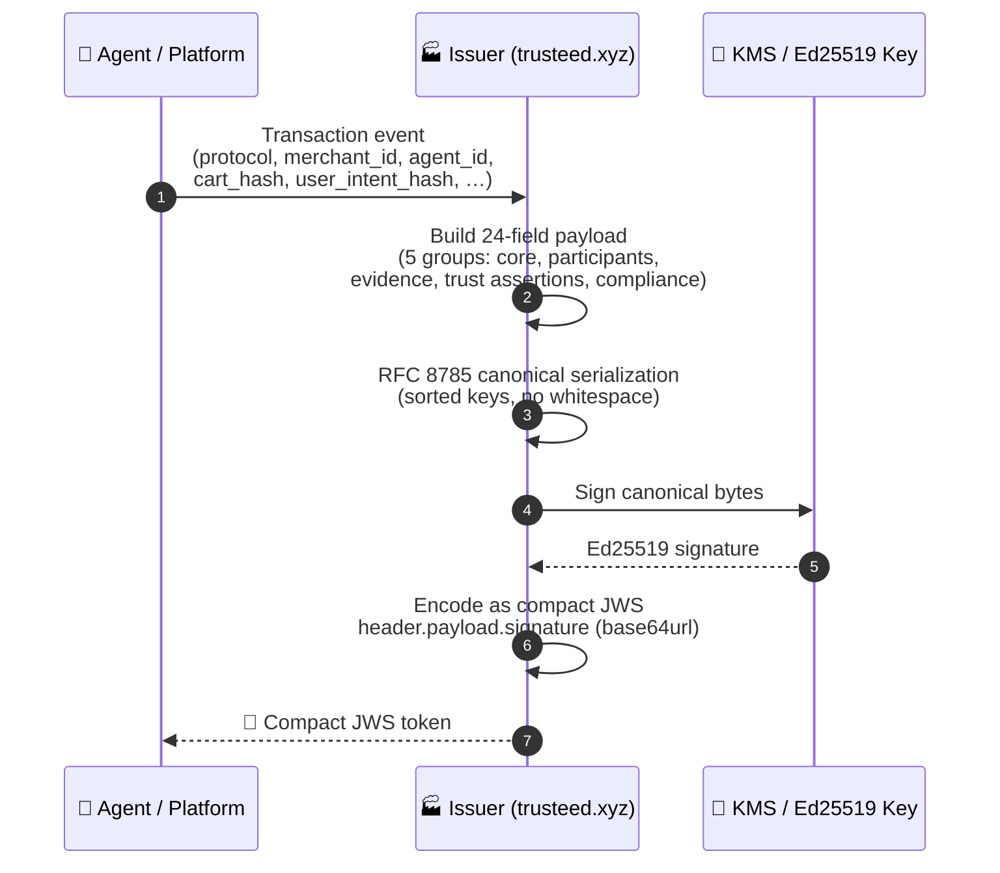
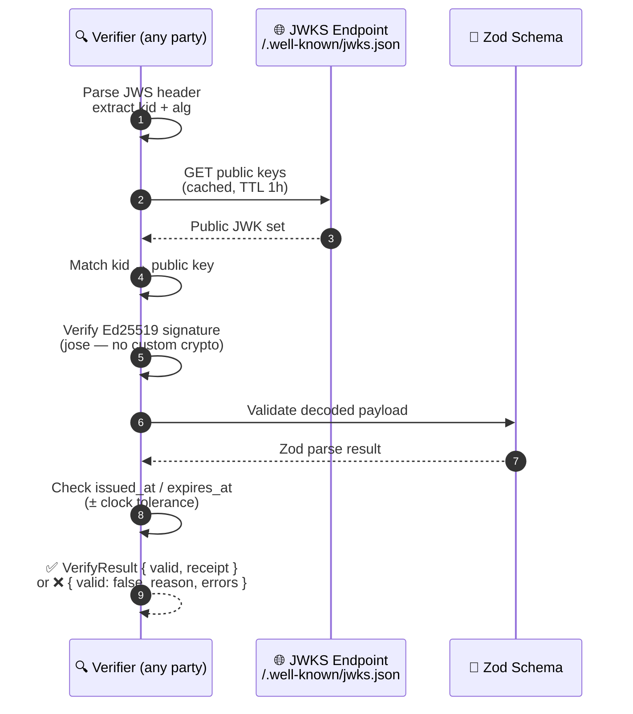
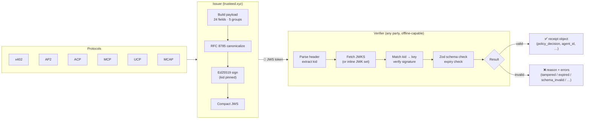

<!-- generated-by: gsd-doc-writer -->

# TrustReceipt

**Merchant-side evidence layer for agentic commerce — signed, portable, offline-verifiable**

[](SPEC.md)
[](LICENSE)
[](https://www.npmjs.com/package/trust-receipt-verifier)
[](https://github.com/trust-receipt/spec)

---

## What it is

TrustReceipt is an open, merchant-oriented receipt format for offline-verifiable agentic commerce evidence across protocols such as ACP, AP2, x402, MCP, UCP, and MCAP. It is **protocol-compatible, not protocol-competing**: rather than replacing AP2 mandates, ACP checkout sessions, Visa TAP signatures, or x402 settlements, it produces a portable cryptographic record of the policy decision applied to them.

A TrustReceipt is a JWS-signed JSON payload verifiable offline against a public JWKS endpoint. Each receipt records who the agent was, which protocol ran, what trust providers vouched for the transaction, what policy was applied, and what decision was reached — in a single self-contained token any party can verify without calling the issuer.

This package is the **reference verifier and issuer** implementation. It is part of Trusteed's merchant-control stack (policy snapshots + agent control points + receipts), but the receipt format itself is open and portable across issuers.

---

## Capability status

| Capability                                               | Status                              | Notes                                                                                 |
| -------------------------------------------------------- | ----------------------------------- | ------------------------------------------------------------------------------------- |
| JWS verification (Ed25519)                               | ✅ Implemented                      | CLI + library, no custom crypto (uses `jose` v6)                                      |
| JWKS-based public key resolution                         | ✅ Implemented                      | Cached fetch with TTL; inline JWK set also supported                                  |
| Schema v1.0                                              | ✅ Stable                           | 10 conformance vectors passing                                                        |
| Schema v1.1 (eIDAS-aligned fields)                       | 🟡 Code-complete / experimental     | 11 additional vectors passing; field set may evolve before v1.2                       |
| RFC 8785 canonical JSON                                  | ✅ Implemented                      | Used for signing + audit chain hashes                                                 |
| Audit chain (`hash_chain_prev`)                          | ✅ Implemented                      | Per-merchant tamper-evident linkage                                                   |
| eIDAS Advanced Electronic Seal posture                   | 🟡 Candidate                        | Field-level support; **not** a Qualified Electronic Seal (no QTSP)                    |
| ESIGN / UETA evidence shape                              | 🟡 Partial                          | `esign_disclosure_hash` + consent context; full disclosure workflow in progress       |
| RFC 3161 trusted timestamp evidence                      | 🟡 Optional / integration-dependent | Hook present via `trust-receipt-tsa-client`; depends on TSA provider                  |
| AWS KMS issuer-side signing                              | 🟡 Optional / issuer-side           | Provided by sibling package `trust-receipt-kms-signer`; not required for verification |
| Reference ports (TS) / language ports (Python, Go, Java) | 🟡 TS only today                    | Ports welcome — see `CONTRIBUTING.md`                                                 |

> ✅ = production-grade implementation. 🟡 = present and tested but subject to change before v1.2 GA, or dependent on operator-side integration.

---

## How it works

A TrustReceipt flows through two independent operations — **issuing** and **verifying** — that can run in different systems at different times, with no shared secret required.

### Issuing a receipt



### Verifying a receipt



### Full picture



**Key properties:**

- **Offline-capable** — verification only needs the JWKS URL (publicly cached); no call back to the issuer
- **Protocol-agnostic** — one receipt format covers x402, AP2, ACP, MCP, UCP, and MCAP via `protocol_artifacts`
- **Audit-chainable** — `hash_chain_prev` links receipts in a tamper-evident per-merchant chain (RFC 8785)
- **Jurisdiction-aware** — `legal_posture` tracks eIDAS / ESIGN / UK-DIATF compliance posture per receipt

---

## Legal Disclaimer

> Verifiable seal for agentic commerce. Each TrustReceipt generates portable cryptographic evidence of origin, integrity, consent, agent authorization, and auditable retention.
> Designed to be compatible with ESIGN/UETA in the US, with eIDAS in the EU as candidate advanced electronic seal evidence, and with the UK Electronic Signatures and Trust Services framework.
> Qualified seals/signatures require issuance or validation by an applicable QTSP.

> **Disclaimer**: TrustReceipt is cryptographically verifiable technical evidence. It does not by itself determine legal liability. Whether a given receipt is admissible or persuasive in a specific jurisdiction or proceeding depends on applicable local law, the consenting parties' agreements, and other facts beyond the scope of this record format.

_See [docs/legal/trust-receipt-claims-policy.md](../../docs/legal/trust-receipt-claims-policy.md) for the full claims policy._

### Regulatory Compatibility Status

| Framework                                      | Jurisdiction | Status                                                                                                                                                                                                                        | v1.1 Fields                                                                                                  |
| ---------------------------------------------- | ------------ | ----------------------------------------------------------------------------------------------------------------------------------------------------------------------------------------------------------------------------- | ------------------------------------------------------------------------------------------------------------ |
| **eIDAS** (Regulation 910/2014)                | EU           | 🟡 Candidate — `legal_posture` progresses `ades_candidate_no_tsa` → `ades_candidate_timestamped` → `ades_candidate_kms`. Qualified seal (QeSeal) requires a QTSP.                                                             | `legal_posture`, `legal_posture_warnings`, `timestamp_evidence`, `esign_disclosure_hash`                     |
| **ESIGN / UETA**                               | US           | 🟡 Partial — Verifiable seal with consent evidence, agent attribution, versioned disclosure, and auditable retention, designed to support ESIGN/UETA. Full disclosure workflow (withdrawal URI, version pinning) in progress. | `esign_disclosure_hash`, `consent_context.consent_disclosure_version`, `consent_context.withdrawal_uri_hash` |
| **Electronic Communications Act 2000 / DIATF** | UK           | 🟡 Schema-compatible — jurisdiction-aware retention (UK: 7 y default) and `legal_posture` field carry UK trust-service evidence. DIATF alignment verified at schema level; operational certification pending.                 | `legal_posture`, `privacy_classification.jurisdiction`, `export_bundle.retention_policy`                     |

> ⚠️ None of the above constitutes legal advice. Regulatory qualification status may change as the implementation evolves. Consult qualified legal counsel for jurisdiction-specific requirements.

---

## Quick verify

```bash
npm install trust-receipt-verifier
```

**v1.0 receipt (compact JWS):**

```typescript
import { verifyTrustReceipt } from "trust-receipt-verifier";

const result = await verifyTrustReceipt(jwsToken, {
  jwksUrl: "https://trusteed.xyz/.well-known/jwks.json",
});

if (result.valid) {
  console.log(result.receipt.policy_decision); // "allow"
} else {
  console.error(result.reason, result.errors);
}
```

**v1.1 envelope (`receipt` + `envelope_metadata` + optional sidecars):**

```typescript
import { verifyReceiptEnvelope } from "trust-receipt-verifier";
import type { VerifyOptions } from "trust-receipt-verifier";

const opts: VerifyOptions = {
  jwksHistory: {
    jws_compact: "<SignedJwksHistory JWS>",
    signed_by_root_sha256: "<issuer-root-sha256>",
  },
  trustAnchorPemSha256: "dd43bf2cd65023d79e41358226ed1197fcea36bc693f1c0fadde0e318bfd76a1",
  policyOidAllowlist: ["1.2.3.4.5.6.7.8.9"],
  // toleranceSeconds: 30,  // default clock-skew tolerance (seconds)
  // mode: "strict",        // default "compat" — see "Strict vs compat" below
  // allowStagingRoots: true, // staging/CI only — never set in production
};

const result = await verifyReceiptEnvelope(envelope, opts);

if (result.outcome === "accepted") {
  console.log(result.recomputedLegalPosture); // "ades_candidate_timestamped"
  if (result.warnings.includes("unknown_trust_provider_present")) {
    // envelope references a trust provider not yet recognised by this verifier version
  }
} else {
  console.error(result.errorCode, result.detail);
  // errorCode may be: "receipt_expired" | "receipt_not_yet_valid" |
  // "jwks_history_signature_invalid" | "unknown_kid" | "schema_invalid" | …
}
```

> **`allowStagingRoots`**: defaults to `false`. When `false` (production default) any `jwksHistory.signed_by_root_sha256` not present in the embedded trust anchor list causes immediate rejection (`jwks_history_signature_invalid`). Set to `true` only in staging or CI environments that use unsigned/stub JWKS history bundles.

---

## Receipt anatomy

A TrustReceipt payload contains 24 fields across five groups:

**Core**

| Field            | Type         | Description                  |
| ---------------- | ------------ | ---------------------------- |
| `receipt_id`     | UUID v4      | Unique receipt identifier    |
| `schema_version` | `"1.0"`      | Schema version literal       |
| `issued_at`      | Unix seconds | When the receipt was created |
| `expires_at`     | Unix seconds | When the receipt expires     |
| `issuer`         | string       | Issuing platform domain      |

**Participants**

| Field            | Type   | Description                                      |
| ---------------- | ------ | ------------------------------------------------ |
| `merchant_id`    | string | Merchant identifier                              |
| `agent_id`       | string | Agent session or instance identifier             |
| `agent_provider` | string | AI provider (`anthropic`, `openai`, `google`, …) |

**Transaction Evidence**

| Field                | Type               | Description                                                                           |
| -------------------- | ------------------ | ------------------------------------------------------------------------------------- |
| `user_intent_hash`   | string (non-empty) | Hash of the user's original intent text — must be non-empty (SHA-256 hex recommended) |
| `cart_hash`          | SHA-256 hex        | Hash of cart contents at decision time (optional)                                     |
| `order_hash`         | SHA-256 hex        | Hash of settled order object (optional)                                               |
| `transaction_id`     | string             | Platform transaction reference (optional)                                             |
| `protocol`           | enum               | `x402 \| AP2 \| ACP \| MCP \| UCP \| MCAP`                                            |
| `protocol_artifacts` | array              | Hashes of protocol-specific evidence objects                                          |
| `payment_reference`  | object             | PSP name + reference, no raw payment data (optional)                                  |

**Trust Assertions**

| Field                       | Type  | Description                                                 |
| --------------------------- | ----- | ----------------------------------------------------------- |
| `risk_signals`              | array | Normalized signals from issuer or providers                 |
| `trust_provider_assertions` | array | Scored assertions from ClearSale, Trulioo, Mastercard, etc. |
| `policy_decision`           | enum  | `allow \| deny \| review \| challenge`                      |

**Compliance**

| Field                    | Type        | Description                                                      |
| ------------------------ | ----------- | ---------------------------------------------------------------- |
| `liability_context`      | object      | Assertor and scope (optional)                                    |
| `consent_context`        | object      | Consent hash, scope, timestamp (optional)                        |
| `privacy_classification` | object      | PII flag, retention days, jurisdiction (optional)                |
| `verification_methods`   | array       | JWKS URL or DID for key resolution — at least one entry required |
| `kid`                    | string      | Key ID used to sign this receipt                                 |
| `hash_chain_prev`        | SHA-256 hex | Previous receipt in audit chain (optional)                       |
| `attachments`            | array       | Named, hashed file references (optional)                         |

---

## Protocol support

| Protocol                                                                                                  | Artifact mapping | Primary artifact types                                  |
| --------------------------------------------------------------------------------------------------------- | ---------------- | ------------------------------------------------------- |
| [MCAP](https://developer.mastercard.com/mastercard-checkout-solutions/documentation/use-cases/agent-pay/) | Defined          | `mcap_consent_hash`, `mcap_nonce`                       |
| [x402](https://github.com/x402-foundation/x402)                                                           | Defined          | `permit2_hash`, `settlement_hash`, `upto_envelope_hash` |
| [AP2](https://github.com/google-agentic-commerce/AP2)                                                     | Defined          | `mandate_hash`, `ap2_consent_hash`                      |
| [MCP](https://modelcontextprotocol.io)                                                                    | Defined          | `mcp_call_hash`, `tool_call_hash`                       |
| [ACP](https://github.com/agentic-commerce-protocol/agentic-commerce-protocol)                             | Defined          | `acp_session_hash`, `acp_policy_hash`                   |
| [UCP](https://github.com/Universal-Commerce-Protocol/ucp)                                                 | Defined          | `ucp_token_hash`                                        |

---

## Conformance

A verifier implementation must pass all 10 test vectors (v1.0) to claim TrustReceipt conformance. Three levels are defined:

> **v1.1 status (2026-05-06)** — eIDAS hardening adds 11 v1.1 vectors under `test-vectors/v11/`. v1.1 schema drops legacy `mandate_hash` / `permit2` / `mcp` rail fields and introduces `payment_authorization_hash`, `authorization_scheme`, `legal_posture_warnings`, and `esign_disclosure_hash`. Combined suite 58/58 passing.

| Level | Name     | Requirement                                                             |
| ----- | -------- | ----------------------------------------------------------------------- |
| 1     | Verifier | Passes all 10 test vectors                                              |
| 2     | Issuer   | Level 1 + correctly issues valid receipts                               |
| 3     | Provider | Level 2 + co-authors ≥1 `trust_provider_assertions` type with real data |

This reference implementation is Level 2 conformant. There are two ways to run the conformance suite:

**(a) Unit tests** — verifies all 10 vectors using pre-built test infrastructure (10 tests):

```bash
pnpm test
```

**(b) End-to-end JWS conformance** — generates a fresh keypair, signs all 10 vectors, calls `verifyTrustReceipt`, and reports pass/fail per vector:

```bash
# Via CLI (requires the package to be built first)
trust-receipt conformance

# Or directly with tsx (no build required)
npx tsx scripts/validate-vectors.ts
```

Add the badge to your project once all 10 pass:

```markdown
[](https://github.com/trust-receipt/spec)
```

---

## Repo structure

```
packages/trust-receipt-verifier/
├── SPEC.md                          — formal specification (authoritative)
├── CONTRIBUTING.md                  — how to contribute vectors, ports, and provider schemas
├── LICENSE                          — MIT
├── src/
│   ├── index.ts                     — package exports
│   ├── verifier.ts                  — verifyTrustReceipt() + parseTrustReceiptUnsafe()
│   ├── issuer.ts                    — issueTrustReceipt()
│   └── schema/
│       └── trust-receipt.schema.ts  — Zod schema (source of truth for TypeScript)
├── test-vectors/
│   ├── README.md                    — how to use the vectors
│   ├── vectors.json                 — vector manifest with expected outcomes
│   ├── valid/                       — TC-001 through TC-005
│   └── invalid/                     — TC-006 through TC-010
├── bin/
│   └── trust-receipt.ts (source) → dist/bin/trust-receipt.js (compiled) — CLI: verify, inspect, generate-key, conformance
└── demo/                            — runnable demo scripts
```

---

## Issue a receipt

```typescript
import { issueTrustReceipt } from "trust-receipt-verifier";

const jws = await issueTrustReceipt({
  payload: {
    issuer: "trusteed.xyz",
    merchant_id: "merchant-001",
    agent_id: "agent-session-xyz",
    agent_provider: "anthropic",
    user_intent_hash: "<sha256-hex-of-user-intent>",
    protocol: "MCP",
    protocol_artifacts: [{ type: "mcp_call_hash", hash: "<sha256-hex>" }],
    policy_decision: "allow",
    verification_methods: [
      { type: "jwks", value: "https://trusteed.xyz/.well-known/jwks.json" },
    ],
    kid: "tr-ed25519-2026-04-29",
  },
  privateKeyJwk: myEd25519PrivateKey,
  kid: "tr-ed25519-2026-04-29",
});
```

> **Canonicalización**: el payload se serializa con RFC 8785 (claves ordenadas, sin whitespace) antes de firmar, garantizando que `SHA-256(payload)` sea idéntico en cualquier implementación conforme.

## CLI

```bash
# Generate an Ed25519 key pair
trust-receipt generate-key

# Verify a v1.0 receipt (compact JWS)
trust-receipt verify receipt.jws --jwks-url https://trusteed.xyz/.well-known/jwks.json

# Verify a v1.1 envelope (JSON object with `receipt` + `envelope_metadata`)
trust-receipt verify envelope.json \
  --type receipt-v11 \
  --jwks-history-file issuer-jwks-history.json \
  --trust-anchor-sha256 dd43bf2cd65023d79e41358226ed1197fcea36bc693f1c0fadde0e318bfd76a1 \
  --policy-oid 1.2.3.4.5.6.7.8.9

# Verify a v1.1 envelope in STRICT mode (semantic trust-anchor enforcement)
trust-receipt verify envelope.json \
  --type receipt-v11 \
  --jwks-history-file issuer-jwks-history.json \
  --trust-anchor-sha256 dd43bf2cd65023d79e41358226ed1197fcea36bc693f1c0fadde0e318bfd76a1 \
  --strict

# Staging / CI only — skip root-anchor check (never use in production)
trust-receipt verify envelope.json --type receipt-v11 \
  --jwks-history-file issuer-jwks-history.json \
  --trust-anchor-sha256 <sha256> \
  --allow-staging-roots

# Inspect a receipt without verifying the signature
trust-receipt inspect receipt.jws

# Run full end-to-end conformance suite (signs + verifies all 10 vectors)
trust-receipt conformance
```

> **`--type` autodetection**: when `--type` is omitted, the CLI inspects the input shape. A JSON object with both `receipt` and `envelope_metadata` keys is treated as `receipt-v11` automatically; a compact `header.payload.sig` string is treated as `receipt` (v1.0).

---

## Documentation

| Document                                     | Description                                                                                          |
| -------------------------------------------- | ---------------------------------------------------------------------------------------------------- |
| [SPEC.md](SPEC.md)                           | Formal specification — wire format, field reference, conformance rules                               |
| [docs/architecture.md](docs/architecture.md) | Internal architecture — signing envelope, key resolution, verification pipeline, security properties |
| [CONTRIBUTING.md](CONTRIBUTING.md)           | How to add conformance vectors, language ports, or trust provider schemas                            |
| [CHANGELOG.md](CHANGELOG.md)                 | Version history and breaking changes                                                                 |

---

## Contributing

See [CONTRIBUTING.md](CONTRIBUTING.md) for how to add conformance vectors, port the verifier to another language, or co-author a `trust_provider_assertions` schema as a trust provider partner.

---

## What a TrustReceipt does NOT prove

A receipt is technical evidence, not legal proof or operational guarantee. It deliberately does **not** assert:

- **That the payment was captured or settled.** A receipt with `policy_decision: "allow"` records the decision and intent. Settlement is recorded by the underlying PSP / rail (Stripe charge, x402 on-chain tx, ACP completion, etc.) and referenced via `payment_reference` or `protocol_artifacts`, not by the receipt itself.
- **That goods or services were delivered.** Fulfilment evidence lives in the merchant's order system.
- **KYC / KYA compliance.** A receipt records that a trust provider asserted a level (e.g. `kya_status`) at issuance time. It is not a substitute for independent KYC/KYA verification.
- **eIDAS Qualified Electronic Seal status.** Even with `legal_posture` populated, a TrustReceipt is at best an **Advanced** Electronic Seal candidate. Qualified seals require issuance by an EU-listed QTSP, which is out of scope for this package.
- **Legal liability or admissibility.** A receipt is cryptographic evidence. Whether it is admissible or persuasive in a specific jurisdiction depends on local law, the parties' agreements, and facts beyond the receipt format.
- **That the user actually intended what the agent did.** The receipt records `user_intent_hash` — i.e. that an intent text existed and was hashed — not that the hash matches a verified human utterance.

If your use case needs any of the above guarantees, the receipt is a useful audit primitive _alongside_ those mechanisms, not a replacement for them.

---

## Threat model

The verifier is designed to detect the following classes of tampering. For each, the verifier returns a structured `{ valid: false, reason }` rather than throwing.

| Threat                                | Defence                                                                                                                    | Verifier behaviour (v1.0 / v1.1)                                                             |
| ------------------------------------- | -------------------------------------------------------------------------------------------------------------------------- | -------------------------------------------------------------------------------------------- |
| Signature forgery / payload tamper    | Ed25519 over RFC 8785 canonical bytes; `kid` pinned in header and payload                                                  | `"signature_invalid"` / `"signature_invalid"`                                                |
| Wrong key used to sign                | `kid` mismatch between JWS header and JWKS entry                                                                           | `"kid_not_found"` / `"unknown_kid"`                                                          |
| Expired receipt                       | `expires_at` checked against verifier clock with configurable tolerance (default ±30 s)                                    | `"expired"` / `"receipt_expired"`                                                            |
| Receipt issued in the future          | `issued_at` checked against verifier clock with same tolerance                                                             | `"not_yet_valid"` / `"receipt_not_yet_valid"`                                                |
| Schema downgrade / unknown fields     | Zod schema validation strict on known fields; unknown top-level keys rejected                                              | `"schema_invalid"` / `"schema_invalid"`                                                      |
| Forged / unsigned JWKS history        | `jwksHistory.signed_by_root_sha256` must match an embedded trust anchor; hard-fail when unknown unless `allowStagingRoot` | n/a (v1.0) / `"jwks_history_signature_invalid"`                                              |
| Unknown trust provider assertion      | Verifier warns but does not reject, preserving forward-compatibility                                                       | n/a (v1.0) / warning `"unknown_trust_provider_present"`                                      |
| Replay of an old receipt              | **Out of scope for the verifier alone.** Consumers must enforce uniqueness via `receipt_id` + `issued_at` + business rules | n/a — verifier returns `valid: true` / `outcome: "accepted"` for not-yet-expired replays     |
| JWKS rotation while a receipt is live | JWKS fetch refreshes on `kid` miss; old keys can be retained in the JWKS set during the rotation grace window              | Verifies as long as `kid` is still published                                                 |
| Compromised issuer key                | Key revocation is operator-side: remove the `kid` from the JWKS set; verifiers will fail closed                            | `"kid_not_found"` / `"unknown_kid"` once removed                                             |
| Clock skew between issuer/verifier    | `toleranceSeconds` option (default 30 s)                                                                                   | Within tolerance: pass. Outside: `"expired"` / `"receipt_expired"` or `"receipt_not_yet_valid"` |
| MITM on JWKS endpoint                 | TLS to JWKS host is the operator's responsibility; pinning the JWKS URL out-of-band defends against rogue substitution     | n/a — verifier trusts the configured URL                                                     |

**Non-goals.** The verifier does **not** validate: (a) whether the underlying payment cleared, (b) whether merchant policy was correctly configured, (c) jurisdictional admissibility, (d) revocation lists external to the JWKS endpoint, or (e) protocol-specific evidence inside `protocol_artifacts` (those are caller-validated against the relevant protocol's spec).

---

## Versioning policy

This package follows **Semantic Versioning** with respect to the public API _and_ the receipt wire format.

| Change type                                         | Bump  | Compatibility                                                                                           |
| --------------------------------------------------- | ----- | ------------------------------------------------------------------------------------------------------- |
| Add optional payload field                          | minor | Older verifiers ignore unknown fields **only if** the field is namespaced or explicitly marked optional |
| Add required payload field                          | major | Older verifiers will reject — coordinated cutover required                                              |
| Remove or rename payload field                      | major | Breaking — issuers must continue emitting v1.x receipts until verifier population catches up            |
| Add new `protocol` enum value                       | minor | Older verifiers will reject unknown enum values; emit only after the verifier ecosystem supports it     |
| Tighten Zod constraint (e.g. format, length)        | minor | Backward-compatible at parse time; new constraint is forward-only                                       |
| Verifier library API change (function signature)    | major | Caller code must update                                                                                 |
| Verifier library API change (new optional argument) | minor | Existing callers unaffected                                                                             |

**Cross-version verification.** Verifier v1.1.x verifies receipts issued under schema v1.0 _and_ schema v1.1. v1.0 receipts will simply lack v1.1 fields (`legal_posture`, `consent_context`, etc.) and the verifier treats them as optional. There is no plan to drop v1.0 verification in any v1.x release — drop requires a v2.0 major bump and a deprecation window of at least 12 months.

**`schema_version` field.** Receipts carry `schema_version: "1.0"` or `schema_version: "1.1"`. The verifier dispatches schema validation on this field. Receipts without a `schema_version` are rejected (`reason: "schema_invalid"`).

---

## Acknowledgements

TrustReceipt is a cross-protocol evidence format. The following external parties define schemas, protocols, or infrastructure that TrustReceipt receipts can reference or attest to. None of these organisations are formal collaborators on this repository; the relationships are interoperability integrations, not endorsements.

### Protocol authors (define schema fields)

| Protocol | Author | TrustReceipt schema field |
| -------- | ------ | ------------------------- |
| [ACP (Agentic Commerce Protocol)](https://github.com/agentcommerceprotocol/acp) | [OpenAI](https://openai.com) + [Stripe](https://stripe.com) | `authorization_scheme: "acp_session_token"`, `protocol: "ACP"` |
| [AP2 (Agent Payment Protocol v2)](https://developers.google.com/wallet) | [Google](https://google.com) | `authorization_scheme: "ap2_mandate_jws"`, `protocol: "AP2"`, `ap2_consent_hash` |
| [x402 (stablecoin payment)](https://github.com/x402-foundation/x402) | [Coinbase](https://coinbase.com) + [Cloudflare](https://cloudflare.com) | `authorization_scheme: "evm_permit2" / "svm_token_authorization" / "x402_native"`, `protocol: "x402"` |
| [MCAP (Mastercard Agent Pay)](https://developer.mastercard.com/product/agent-pay/) | [Mastercard](https://mastercard.com) | `authorization_scheme: "mcap_cart_binding"`, `protocol: "MCAP"`, `mcap_consent_hash` |
| [MCP (Model Context Protocol)](https://github.com/modelcontextprotocol/specification) | [Anthropic](https://anthropic.com) | `authorization_scheme: "mcp_tool_invocation"`, `protocol: "MCP"` |
| [UCP (Universal Commerce Protocol)](https://github.com/Universal-Commerce-Protocol/ucp) | [Google](https://google.com) | `authorization_scheme: "ucp_rule_set_plus_agent_token"`, `protocol: "UCP"` |

### Active runtime providers (wired in `trust_provider_assertions[]`)

These providers produce structured assertions that the `recomputeLegalPosture` logic in `verify-1.1.ts` reads when determining the verifier-authoritative `LegalPosture`. Use the exported type predicates (`isRfc9421ProviderAssertion`, `isHumanProviderAssertion`, `isVisaTapProviderAssertion`) to narrow to the typed shapes defined in `types-1.1.ts`.

| Provider | Assertion `provider` field | Integration |
| -------- | ------------------------- | ----------- |
| [IETF RFC 9421](https://www.rfc-editor.org/rfc/rfc9421) (HTTP Message Signatures) | `"rfc9421-native"` | Verifies HTTP Message Signatures from any agent with a public JWKS endpoint; issuer wires this optionally |
| [HUMAN Security — AgenticTrust](https://www.humansecurity.com/agentictrust) | `"human"` | Optional agent-identity integration; no HUMAN SDK is imported in this verifier package |
| [Visa TAP](https://developer.visa.com/) (Trusted Agent Protocol) | `"visa"` | Validated when signer domain is `*.visa.com` or `*.visa.net` with tag `"agent-browser-auth"` or `"agent-payer-auth"` |

### Issuer-side infrastructure (not used by this verifier package)

| Tool | Role |
| ---- | ---- |
| [freeTSA](https://freetsa.org/) | Default Phase-1 RFC 3161 timestamp authority; URL is per-receipt (`tsa_endpoint` field) — not hardcoded here |
| [AWS KMS](https://aws.amazon.com/kms/) | Ed25519 issuer signing keys and HMAC CMKs for PII-sourced hashes; handled by sibling package `trust-receipt-kms-signer` |

---

## Trademark Notice

TrustReceipt is not affiliated with, endorsed by, or officially supported by Mastercard, Anthropic, Skyfire, Coinbase, HUMAN Security, Visa, or any other named protocol owner or company referenced in this specification. Protocol names (AP2, MCAP, ACP, MCP, x402, UCP) are used descriptively to indicate interoperability targets only. All trademarks and registered marks are the property of their respective owners.

---

## License

MIT — see [LICENSE](LICENSE). Copyright MCPWebStore (trusteed.xyz), 2026.
